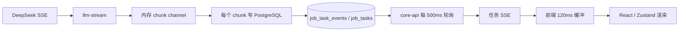
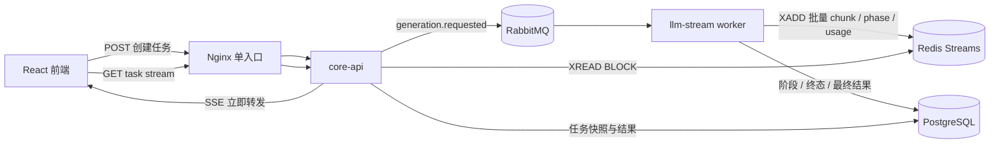
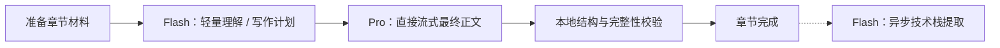
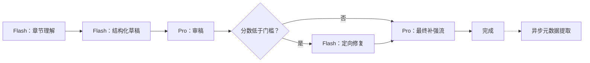

# 生成链路流式体验、缓存指标与双模式优化执行计划

> 状态：待实施  
> 日期：2026-07-06  
> 适用范围：`core-api`、`llm-stream`、前端生成工作台、Nginx 网关、Redis、PostgreSQL 任务数据  
> 默认产品决策：标准模式默认启用，深度模式由用户主动选择  
> 明确不做：浏览器刷新后完整恢复已经输出的正文流

## 1. 文档目的

本文档把当前生成链路的三个问题收敛成一份可以直接执行、验证和回滚的工程计划：

1. 修正前端“缓存命中率”与 DeepSeek 后台统计口径不一致的问题。
2. 恢复微服务化前接近直连 SSE 的流式观感，同时保留任务创建、取消和最终结果持久化能力。
3. 引入默认“标准模式”和可选“深度模式”，让速度、成本与文章质量成为用户可理解的产品选择。

本文档只规划上述范围，不顺带重构 parser、export、review 等任务链路，也不进行 UI 视觉重设计。

## 2. 已确认需求与关键决策

### 2.1 用户确认

- “旧版”指微服务化之前的版本。
- 接受“标准模式 / 深度模式”双模式。
- 不要求浏览器刷新后恢复完整生成进度。
- 标准模式作为默认选项。

### 2.2 工程决策

- RabbitMQ 继续负责生成任务的异步调度，不承担浏览器实时正文分发。
- Redis Streams 负责短生命周期实时事件传输，替代 PostgreSQL 逐 chunk 事件写入和 500ms 轮询。
- PostgreSQL 只保存任务状态变化、错误、usage 汇总和最终结果。
- 前端按动画帧或 30–50ms 窗口批量提交内容，不为每个模型 token 更新 React 状态。
- 标准模式缩短模型关键路径；深度模式保留当前多阶段质量门禁。
- Redis Stream 仅用于活动任务和短时间故障缓冲，不承诺长期重放。

## 3. 当前问题与代码证据

### 3.1 缓存命中率口径不一致

DeepSeek 流式请求已经设置 `stream_options.include_usage=true`，并能读取最终 usage：

- `backend/shared/platform/llm/deepseek.go`
- `backend/shared/platform/llm/deepseek_usage_test.go`

当前系列生成的问题不在“完全没有读取 usage”，而在于展示范围：

- `finalizeSeriesChapterDraft` 在最终补强请求结束后立即发送一次 `status=usage`。
- 此时发送的是最终 `deepseek-v4-pro` 请求的 usage。
- 理解、草稿、审稿、条件修复等阶段虽然在后端被累计，但没有作为章节累计值发给前端。
- 前端卡片把该值显示为笼统的“缓存命中”，用户自然会理解为整章或整次任务数据。

此外，DeepSeek 后台截图通常按日期和模型聚合，而前端是单章、单次请求数据。不同模型、时间窗口、API Key、`user_id` 和请求范围不能直接比较。

当前公式本身是正确的：

```text
cache_hit_rate = prompt_cache_hit_tokens
               / (prompt_cache_hit_tokens + prompt_cache_miss_tokens)
```

需要修复的是统计范围、标签和缺失值语义，而不是简单修改公式。

### 3.2 微服务化后的流式顿挫

当前实时正文经过如下链路：



关键代码路径：

- `backend/services/llm-stream/domain/stream/task_consumer.go`
- `backend/services/llm-stream/domain/stream/task_store.go`
- `backend/services/core-api/domain/task/handler.go`
- `backend/services/core-api/domain/task/repository.go`
- `frontend/src/lib/streamFlushBuffer.ts`
- `frontend/src/hooks/generator/useSeriesGenerator.ts`

每个 chunk 当前可能触发：

1. 查询任务是否存在。
2. 插入一条 `job_task_events`。
3. 更新 `job_tasks.status` 和 `updated_at`。

随后 `core-api` 每 500ms 查询一次事件列表和任务状态。即使 Nginx 与 Gin 每次都主动 `Flush`，客户端仍然只能看到半秒级批次。前端再增加 120ms 合并窗口后，顿挫属于架构预期结果，而不是浏览器偶发现象。

### 3.3 总生成耗时增加

时间线需要分开理解：

- 2026-06-01：系列生成已引入理解、草稿、审稿、最终补强质量管线。
- 2026-06-03：微服务化引入 RabbitMQ、任务事件表和任务 SSE。
- 2026-06-29：质量合同、JSON 修复、条件修复、usage 和高推理选项进一步增强。

因此：

- “输出不丝滑”主要是微服务事件传输链路造成的。
- “总耗时更长”同时受到质量管线增强、Pro 高推理、条件修复、大输入材料和数据库 chunk 写入影响。

当前深度链路每章至少包含：

| 顺序 | 阶段 | 模型 | 输出方式 | 是否关键路径 |
| --- | --- | --- | --- | --- |
| 1 | 章节理解 | Flash | 非流式 JSON | 是 |
| 2 | 章节草稿 | Flash | 非流式 JSON | 是 |
| 3 | 章节审稿 | Pro | 非流式 JSON | 是 |
| 4 | 条件修复 | Flash | 非流式 JSON | 条件执行 |
| 5 | 最终补强 | Pro | 流式 Markdown | 是 |
| 6 | 技术栈提取 | Flash | 非流式 JSON | 当前阻塞完成 |

JSON 不合法时还会追加修复请求，因此每章通常为 5–9 次模型调用。正文只有进入最终补强阶段后才开始出现在页面上，感知首字时间远大于 DeepSeek 单次请求的 TTFT。

## 4. 目标与非目标

### 4.1 用户体验目标

| 指标 | 目标 |
| --- | --- |
| 正文开始流式输出后的 chunk 间隔 p95 | `< 100ms` |
| 活动生成页面的可交互性 | 停止按钮、滚动和导航无明显阻塞 |
| 标准模式总耗时 | 相比当前深度链路至少降低 40% |
| 缓存展示 | 与 DeepSeek 原始 usage 可逐项核对 |
| 模式默认值 | `standard` |
| 刷新恢复 | 不保证正文流重放；只展示任务快照或最终结果 |

### 4.2 工程目标

- 生成 chunk 不再同步写入 PostgreSQL。
- `core-api` 不再通过固定 500ms 定时器获取活动正文。
- 任务创建、鉴权、取消、终态和最终结果仍有可靠记录。
- 标准模式和深度模式共用任务、SSE、usage 与持久化协议。
- 新链路通过功能开关渐进发布，出现问题时可回退旧数据库事件传输。

### 4.3 非目标

- 不提供跨天或长期的正文事件回放。
- 不要求刷新后从上一个字符继续渲染。
- 不在本次计划中彻底消除 `llm-stream` 对任务表的过渡访问边界。
- 不修改 parser、export、review 的事件传输模型。
- 不进行生成工作台整体视觉重设计。
- 不通过盲目提高模型并发来掩盖单章关键路径过长的问题。

## 5. 目标架构

### 5.1 总体拓扑



### 5.2 职责边界

| 组件 | 职责 |
| --- | --- |
| `core-api` | 创建任务、鉴权 SSE、读取 Redis 实时事件、提供任务快照与取消接口 |
| `llm-stream` | 消费任务、调用 DeepSeek、聚合 chunk、发布实时事件、写入阶段与终态 |
| RabbitMQ | 可靠调度生成任务 |
| Redis Streams | 活动任务的低延迟短期事件通道 |
| PostgreSQL | 任务事实、阶段状态、usage 汇总、最终生成结果 |
| Nginx | 单一公开入口，保持 SSE 禁用代理缓冲 |
| 前端 | 选择模式、消费 SSE、批量渲染、展示阶段与 usage |

### 5.3 为什么选择 Redis Streams

Redis 已经是当前 Compose 依赖。与可选方案相比：

| 方案 | 延迟 | 多实例 | 丢失连接时缓冲 | 复杂度 | 结论 |
| --- | --- | --- | --- | --- | --- |
| PostgreSQL 轮询 | 高 | 支持 | 支持 | 已存在 | 只保留回滚路径 |
| Redis Pub/Sub | 低 | 支持 | 不支持，订阅前事件会丢失 | 低 | 存在任务创建与订阅竞态 |
| Redis Streams | 低 | 支持 | 支持短期缓冲 | 中 | 推荐 |
| 浏览器直连 worker 内存通道 | 最低 | 不自然 | 不支持 | 低 | 会绑定单实例，不作为目标架构 |

虽然产品不要求刷新恢复，但 Redis Streams 能覆盖“任务已开始、浏览器尚未完成 SSE 订阅”的短竞态，也能让 `core-api` 和 `llm-stream` 独立扩容。

## 6. 实时事件协议

### 6.1 Redis Key

```text
inkwords:generation:stream:{task_id}
```

约束：

- `task_id` 必须来自已经鉴权并存在的任务，不接受任意用户字符串拼接。
- 使用 `XADD ... MAXLEN ~ <limit>` 控制单任务事件数量。
- 活动任务设置短 TTL；终态后再次缩短 TTL。
- 正文可能包含源码或私人材料，Redis 不做长期留存。

初始长度与 TTL 不在代码中散落硬编码，通过配置统一管理，并在真实压力测试后确定。

### 6.2 统一事件 Envelope

建议所有生成事件使用同一结构：

```json
{
  "version": 1,
  "task_id": "uuid",
  "event_type": "chunk",
  "sequence": 123,
  "occurred_at": "2026-07-06T09:30:00.000Z",
  "payload": {
    "chapter_sort": 2,
    "title": "配置管理与环境变量",
    "phase": "finalizing",
    "content": "正文片段"
  }
}
```

允许的 `event_type`：

- `progress`
- `phase`
- `chunk`
- `usage`
- `chapter_completed`
- `chapter_failed`
- `task_completed`
- `task_failed`
- `cancelled`
- `heartbeat`

### 6.3 顺序与并发

- Redis Stream ID 作为传输顺序依据。
- `sequence` 用于协议断言、日志和前端去重，不替代 Redis ID。
- 多章节并发时，任务级事件允许交错；同一章节的内容必须保持生成顺序。
- SSE 输出必须保留 `id:` 字段，便于诊断重复或乱序，即使产品不承诺刷新恢复。

### 6.4 chunk 合并

worker 不应为每个模型 delta 都执行一次 `XADD`。建议满足任一条件时发送：

- 距上次发送达到 30–50ms。
- 待发送内容达到配置的字符或字节阈值。
- 收到阶段切换、错误、完成或取消事件。

阶段、错误和终态事件不等待普通正文合并窗口，必须先 flush 待发送正文，再立即发布。

### 6.5 SSE 行为

- `core-api` 鉴权并校验任务归属后执行 `XREAD BLOCK`。
- 初次连接从任务创建后的起始 ID 读取，避免订阅竞态丢失首批事件。
- 活动连接继续发送 heartbeat，避免代理空闲断开。
- Nginx 继续使用 `proxy_buffering off`、`proxy_cache off` 和 `X-Accel-Buffering: no`。
- Redis 读取失败时输出稳定错误事件，不能返回被额外转义的 payload。

## 7. PostgreSQL 写入策略

### 7.1 保留的数据

PostgreSQL 保留：

- 任务创建、开始、取消、成功、失败状态。
- 章节阶段切换和章节终态。
- 每阶段 usage 汇总。
- 每章最终正文和任务最终结果。
- 可用于审计和排障的稳定错误信息。

### 7.2 不再保存的数据

- 每个模型 token 或细粒度正文 chunk。
- 仅用于动画效果的 transient 状态。
- Redis 已承载且对最终事实没有价值的 heartbeat。

### 7.3 状态更新规则

- `job_tasks.status=streaming` 只在第一次进入流式阶段时更新一次。
- 后续正文事件不得重复更新同一任务状态。
- 章节状态只在 phase 或 terminal 发生变化时落库。
- usage 在阶段完成时合并写入，不在每个流式 chunk 中更新。

### 7.4 回滚路径

初始发布保留：

```text
GENERATION_STREAM_TRANSPORT=database|redis
```

- 首次部署默认保持 `database`，在预发布或本地显式开启 `redis`。
- 验证通过后将默认值切换为 `redis`。
- 回滚只切换配置，不执行破坏性数据库迁移。
- 旧 `job_task_events` 数据暂不删除；后续单独制定清理和保留策略。

如果继续保留数据库流作为回滚路径，应评估 `(task_id, id)` 组合索引，并用 `EXPLAIN` 验证 `WHERE task_id=? AND id>? ORDER BY id` 查询。索引迁移必须说明额外存储和写放大成本。

## 8. usage 与缓存指标设计

### 8.1 原始 usage 模型

每次 DeepSeek 请求完成后记录：

```json
{
  "scope": "phase",
  "phase": "reviewing",
  "model": "deepseek-v4-pro",
  "prompt_tokens": 2342,
  "completion_tokens": 2761,
  "prompt_cache_hit_tokens": 0,
  "prompt_cache_miss_tokens": 2342,
  "provider_reported": true
}
```

规则：

- `provider_reported=false` 表示提供商没有返回相关字段，UI 显示“未上报”。
- hit 和 miss 均为 0 且 provider 已上报时，显示“暂无可计算输入”。
- miss 大于 0 且 hit 为 0 时，才是真实的 0%。
- 不使用估算 token 冒充提供商账单 token。

### 8.2 聚合层级

| scope | 含义 | UI 用途 |
| --- | --- | --- |
| `phase` | 单个模型请求或阶段 | 详情展开 |
| `chapter` | 一章全部阶段按模型累计 | 章节卡片默认展示 |
| `task` | 整个系列或单篇任务累计 | 顶部任务摘要 |

聚合必须先求和 token，再计算命中率，禁止直接平均各阶段百分比。

### 8.3 前端展示

章节卡片默认显示：

```text
输入 12.4K · 输出 8.1K · 缓存命中 1.1%（512 / 46.4K）
```

展开后按模型和阶段显示：

```text
Flash
  理解      2.1K / 命中 0%
  草稿      6.8K / 命中 3.4%

Pro
  审稿      1.3K / 命中 0%
  最终补强  2.2K / 命中 0%
```

百分比至少保留一位小数，避免小比例被整数舍入成误导性的 0%。

### 8.4 缓存复用优化

在完成统计修正后再优化命中率：

- 使用不含个人信息的稳定用户/项目哈希作为 DeepSeek `user_id`。
- 避免当前每个新 `parentID` 都生成全新缓存隔离空间。
- 将稳定的系列规则、读者画像和公共材料放在 prompt 前缀。
- 将章节标题、阶段指令和其他动态内容放在稳定前缀之后。
- 同时保留用户间隔离，禁止跨用户共享缓存身份。
- 分别测量冷缓存和热缓存，不以 DeepSeek 后台日聚合图替代请求级验证。

## 9. 标准模式与深度模式

### 9.1 API 契约

生成请求增加：

```json
{
  "generation_mode": "standard"
}
```

规则：

- 允许值：`standard`、`deep`。
- 请求缺失时由后端默认成 `standard`，不能只依赖前端默认值。
- 非法值返回稳定的 400 错误。
- 最终任务结果持久化实际使用的模式，便于统计与复现。

### 9.2 标准模式

目标：在保持基本结构、技术准确性和可读性的前提下，大幅缩短正文首次出现时间和总耗时。

建议关键路径：



约束：

- 理解阶段关闭深度思考并限制输出规模。
- 最终正文直接流式输出，不先生成一份完整不可见草稿。
- 技术栈提取移出用户等待的关键路径。
- 本地检查标题、空内容、截断、Markdown 结构和必要章节元素。
- 只有明确失败时才触发一次定向修复，不默认完整审稿。

预期每章关键路径为 2 次模型请求，极端修复时为 3 次。

### 9.3 深度模式

深度模式保留当前质量门禁：



调整项：

- 技术栈提取同样移出关键路径。
- usage 发送从最终阶段内部移到管线聚合完成之后。
- 每个阶段上报开始时间、结束时间、模型和 usage。
- JSON 修复和质量修复分别计数，不能隐藏在总耗时中。

### 9.4 模式选择 UI

- 默认选中“标准生成”。
- “深度生成”旁明确提示“多阶段审稿，耗时与成本更高”。
- 模式选择在任务创建前确定，运行中不能切换。
- 当前选择写入生成请求，不需要长期存入浏览器本地缓存。
- 移动端保证两个选项键盘可达、焦点可见、文字不截断。

## 10. 输入材料与 token 预算

当前按 rune 截断且上限较大，无法直接反映模型 token、费用和上下文压力。计划改为：

1. 解析章节关联文件并去重。
2. 保留文件路径、模块摘要和必要代码片段。
3. 使用与当前模型匹配的 tokenizer 或提供商 usage 反馈校准预算。
4. 超预算时优先保留章节声明的关联文件，再选择检索相关片段。
5. 标准模式与深度模式使用独立可配置预算。
6. 日志记录原始字符数、选择后字符数和估算 token，但不输出私人正文。

初始预算值必须通过真实项目样本确定，不在未测量前拍脑袋写死。

## 11. 前端状态与渲染优化

### 11.1 当前风险

`GeneratorStatus` 订阅整个 `chapterContents`、`chapterStatus`、`chapterPhases` 和 `chapterUsage` 对象。任意一章更新都会让整个章节列表重新渲染。

单篇生成还可能在每次 flush 时让完整 Markdown 内容重新解析。随着正文增长，更新成本可能随内容长度增加。

### 11.2 Zustand 订阅拆分

将容器与章节卡片拆分：

```tsx
function GeneratorStatus() {
  const outline = useStreamStore((state) => state.outline)
  return outline?.map((chapter) => (
    <ChapterGenerationCard key={chapter.sort} sort={chapter.sort} />
  ))
}

const ChapterGenerationCard = memo(function ChapterGenerationCard({ sort }: { sort: number }) {
  const content = useStreamStore((state) => state.chapterContents[sort] ?? '')
  const status = useStreamStore((state) => state.chapterStatus[sort] ?? 'pending')
  const phase = useStreamStore((state) => state.chapterPhases[sort] ?? 'pending')
  return /* card */
})
```

原则：

- 高频内容只让对应章节卡片更新。
- 事件处理回调使用 `useStreamStore.getState()` 按需读取，不订阅回调里才需要的状态。
- 临时待 flush 内容保存在 module-level buffer 或 ref 中，不为每个 delta 写 Zustand。
- 状态、错误和停止按钮属于紧急更新；正文追加可以使用 React transition 降低对交互的抢占。
- 不为了简单字符串或布尔值引入无意义的 `useMemo`。

### 11.3 flush 调度

建议调度策略：

1. SSE handler 只把内容追加到 transient buffer。
2. 首个待处理 chunk 安排一次 `requestAnimationFrame`。
3. 若距离上次提交不足最小间隔，则保留到下一帧或 30–50ms 窗口。
4. 达到字节阈值、阶段切换或完成时立即 flush。
5. 取消任务时清空未提交正文，正常完成时强制 flush。

不能只把当前 `120ms` 改成更小常量；后端批次、状态订阅范围和 Markdown 解析成本必须一起处理。

### 11.4 Markdown 渲染

- 系列生成卡片继续只显示末尾摘要，不在每帧解析完整 Markdown。
- 单篇生成评估使用轻量纯文本/代码预览作为流式阶段展示，完成后再切换完整 `MarkdownEngine`。
- 如果必须实时 Markdown，使用较低频率的 deferred content，不阻塞停止按钮和页面交互。

## 12. 可观测性

### 12.1 指标

建议增加以下低基数指标：

| 指标 | 标签 |
| --- | --- |
| `generation_task_duration_seconds` | mode、source_type、status |
| `generation_phase_duration_seconds` | mode、phase、model、status |
| `generation_ttft_seconds` | mode、model |
| `generation_stream_chunk_gap_seconds` | transport、mode |
| `generation_stream_delivery_lag_seconds` | transport |
| `generation_stream_events_total` | event_type、transport |
| `generation_stream_db_writes_total` | operation |
| `generation_usage_tokens_total` | scope、model、token_type |
| `generation_repairs_total` | repair_type、model |
| `generation_redis_errors_total` | operation |

禁止把 `task_id`、`user_id`、文章标题作为 metrics 标签；这些高基数字段只进入结构化日志或 trace。

### 12.2 结构化日志

每个阶段至少包含：

- `request_id`
- `task_id`
- `chapter_sort`
- `generation_mode`
- `phase`
- `model`
- `duration_ms`
- `prompt_tokens`
- `completion_tokens`
- `cache_hit_tokens`
- `cache_miss_tokens`
- `repair_count`
- `transport`

不得记录 API Key、JWT、完整 prompt、正文、源码或用户敏感信息。

### 12.3 性能基线方法

使用同一份固定材料和 10 章大纲，至少执行：

| 组别 | 模式 | 传输 | 缓存 |
| --- | --- | --- | --- |
| A | 当前深度链路 | Database polling | 冷缓存 |
| B | 深度模式 | Redis Streams | 冷缓存 |
| C | 标准模式 | Redis Streams | 冷缓存 |
| D | 标准模式 | Redis Streams | 热缓存 |

每组至少运行 3 次，记录中位数与 p95。DeepSeek 服务端排队会产生波动，不能用单次运行下结论。

## 13. 故障与边界场景

### 13.1 Redis 不可用

- 任务开始前 Redis 不可用：新传输开关启用阶段允许回退 database transport。
- 生成过程中 Redis 失败：worker 记录错误并尝试有限次数重连；不能无限阻塞 DeepSeek 响应读取。
- 重连失败：任务进入稳定失败状态，最终错误必须写 PostgreSQL。
- 不允许静默丢正文后仍把任务标记成功。

### 13.2 客户端断开

- 用户主动停止：调用取消接口，worker 最迟在当前取消轮询窗口内取消模型上下文。
- 网络断开但未取消：任务可继续执行并持久化最终结果。
- 页面刷新：不恢复完整流；页面重新加载后只展示任务仍在运行或最终结果。
- 慢客户端：`core-api` 不无限积累内存队列，必要时断开 SSE，并让任务继续后台完成。

### 13.3 worker 异常

- worker 崩溃前已经写入的 Redis 事件可能短期存在，但不能代表任务成功。
- 任务超时或消费者重试仍以 PostgreSQL 终态和幂等键为准。
- 重复消费不得重复创建博客或重复累计 usage。

### 13.4 多章节并发

- 同章事件顺序必须稳定。
- 不同章节允许交错。
- 前端按 `chapter_sort` 分桶缓冲。
- 单个高频章节不能使其他章节状态事件长期饥饿。

## 14. 分阶段实施任务

### Phase 0：基线与协议冻结

任务：

- 为当前链路增加不改变行为的阶段计时和 chunk 间隔日志。
- 固定测试材料、大纲和记录模板。
- 冻结 `generation_mode`、实时事件 envelope 和 usage schema。
- 补充本文档评审结论，不开始 Redis 改造前先确认协议测试。

主要文件：

- `backend/services/llm-stream/app/generation/*`
- `backend/services/core-api/domain/task/*`
- `frontend/src/services/generationTasks.ts`

完成标准：

- 能从一次任务日志还原各阶段耗时。
- 前后端对协议字段有自动化契约测试。

### Phase 1：缓存统计正确性

任务：

- 将阶段 usage 放入统一聚合器。
- 在章节管线结束后发送 chapter usage。
- 在任务结束后生成 task usage。
- 前端新增范围、模型和阶段展示。
- 对 missing、zero、small percentage 和多模型聚合补测试。

主要文件：

- `backend/shared/platform/llm/deepseek.go`
- `backend/services/llm-stream/app/generation/decomposition_types.go`
- `backend/services/llm-stream/app/generation/decomposition_quality.go`
- `backend/services/llm-stream/app/generation/decomposition_series.go`
- `frontend/src/hooks/generator/useSeriesGenerator.ts`
- `frontend/src/store/streamStore.ts`
- `frontend/src/components/generator/GeneratorStatus.tsx`

完成标准：

- 章节累计值等于所有阶段原始值之和。
- 前端显示一位小数和 hit/miss token。
- API 未上报时不显示 0%。

### Phase 2：Redis 实时事件通道

任务：

- 增加 Redis Stream publisher/reader 抽象。
- worker 按时间或大小批量发布 chunk。
- `core-api` 任务 SSE 改为阻塞读取。
- 状态、usage、错误和完成事件使用同一 envelope。
- 保留 database transport 功能开关。
- 配置 Stream 长度、TTL、阻塞读取和 heartbeat。

建议新增模块：

```text
backend/shared/platform/eventstream/
backend/services/llm-stream/app/streaming/
```

现有改动入口：

- `backend/services/llm-stream/domain/stream/task_consumer.go`
- `backend/services/llm-stream/domain/stream/task_store.go`
- `backend/services/core-api/domain/task/handler.go`
- `backend/services/core-api/domain/task/service.go`
- `docker-compose.yml`
- `backend/.env.example`

完成标准：

- Redis 模式下 chunk 不写 `job_task_events`。
- `core-api` 不运行 500ms 活动正文轮询。
- 取消、错误和最终结果测试通过。

### Phase 3：前端流式渲染

任务：

- 调整 `streamFlushBuffer` 为帧/时间/大小混合调度。
- 拆分章节卡片 Zustand selector。
- 非紧急正文更新使用 transition 或 deferred rendering。
- 单篇 Markdown 流式渲染做专项性能验证。
- 保证完成、错误和取消前强制 flush 或清空。

主要文件：

- `frontend/src/lib/streamFlushBuffer.ts`
- `frontend/src/store/streamStore.ts`
- `frontend/src/hooks/generator/useSeriesGenerator.ts`
- `frontend/src/components/generator/GeneratorStatus.tsx`
- `frontend/src/components/MarkdownEngine.tsx`

完成标准：

- 只有正在输出的章节卡片因正文变化而重渲染。
- 停止按钮在高频输出下仍能立即响应。
- 桌面和移动端没有内容跳动、滚动陷阱或文字截断。

### Phase 4：标准 / 深度模式

任务：

- 后端请求 DTO、RabbitMQ 消息和任务结果增加模式字段。
- 前端生成入口增加模式选择，默认 standard。
- 抽取共享的材料准备、最终持久化和 usage 聚合逻辑。
- 实现标准模式短关键路径。
- 深度模式复用现有质量管线并将元数据提取移出关键路径。
- 为非法模式、旧客户端缺失模式和任务重试补兼容测试。

主要文件：

- `frontend/src/services/generationTasks.ts`
- `frontend/src/hooks/generator/useSeriesGenerator.ts`
- `frontend/src/components/generator/*`
- `backend/services/core-api/domain/task/dto.go`
- `backend/shared/platform/rabbitmq/*`
- `backend/services/llm-stream/domain/stream/*`
- `backend/services/llm-stream/app/generation/*`

完成标准：

- 请求不带模式时实际使用 standard。
- 两种模式都能生成、停止、失败和持久化。
- 最终结果能识别实际模式及各阶段 usage。

### Phase 5：真实验证与渐进发布

任务：

- 执行单元、集成、Docker、浏览器和真实 DeepSeek A/B 测试。
- 在本地或预发布使用 Redis transport。
- 对比延迟、费用、缓存和文章质量。
- 达标后将 Redis 与标准模式设为默认。
- 保留至少一个发布周期的 database transport 回滚开关。

完成标准：

- 所有验收矩阵通过。
- 标准模式达到耗时目标。
- 深度模式没有关键质量门禁回归。
- 日志中不存在敏感正文或凭据。

## 15. 测试与验收矩阵

### 15.1 后端单元测试

| 场景 | 断言 |
| --- | --- |
| DeepSeek usage chunk | 正确解析 hit/miss，忽略 null usage |
| phase usage 聚合 | token 求和正确，不平均百分比 |
| chapter/task usage | 多阶段、多模型累计正确 |
| chunk 合并 | 时间、大小和终态均能触发 flush |
| Redis 事件顺序 | 同章 sequence 单调递增 |
| Redis 失败 | 返回稳定错误且任务不假成功 |
| generation mode | 默认 standard，非法值拒绝 |
| standard pipeline | 不执行完整草稿和审稿链路 |
| deep pipeline | 条件修复门禁保持有效 |
| cancellation | 模型上下文取消且任务终态正确 |

### 15.2 前端单元测试

| 场景 | 断言 |
| --- | --- |
| 小比例缓存 | 1.1% 不显示成 0% |
| usage 缺失 | 显示“未上报” |
| 多模型 usage | 展开分组和总和正确 |
| 章节缓冲 | 只更新对应章节 |
| 完成事件 | 先 flush 正文再标记完成 |
| 取消事件 | 清空未提交缓冲 |
| 模式选择 | 默认 standard，请求携带选择值 |
| 高频 chunk | 合并后提交次数显著少于事件数 |

### 15.3 集成测试

- 使用假 LLM 每 10ms 输出小 chunk，验证 Redis 到 SSE 的顺序和间隔。
- 在订阅建立前先写入首批 Stream 事件，验证不丢首段正文。
- 同时运行多个章节，验证事件可交错但章内有序。
- 重启 `core-api`，验证活动任务可以继续读取短期 Stream；不承诺 UI 完整恢复。
- 停止任务，验证 worker 在取消窗口内退出。
- Redis 不可用时验证 database transport 回滚开关。

### 15.4 浏览器验证

实施 UI 变更后必须通过可用的 Browser 工具执行：

```text
生成页 -> 选择标准模式 -> 开始生成 -> 观察逐字输出 -> 停止生成
生成页 -> 选择深度模式 -> 开始生成 -> 观察阶段推进 -> 完成并显示累计 usage
```

检查：

- 页面身份、非空页面和无框架错误覆盖层。
- Console 无相关 error/warn。
- 标准/深度模式键盘可达且焦点可见。
- 正文输出期间停止按钮可用。
- 章节卡片没有批量闪烁。
- 桌面与移动端截图符合预期。
- 完成后 usage 展示与网络事件一致。

### 15.5 Docker 验证

```bash
docker compose --env-file backend/.env config
docker compose --env-file backend/.env up -d --build
docker compose --env-file backend/.env ps
curl -I http://localhost
curl --fail http://localhost/api/v1/ping
```

并补充：

- Redis Stream 写入与阻塞读取健康检查。
- `/api/v1/tasks/:id/stream` 仍命中 `core-api` SSE location。
- Nginx 未恢复代理缓冲。
- RabbitMQ 消费、取消和终态写入均可观察。

### 15.6 真实 DeepSeek 验证

- 使用相同材料和大纲分别跑标准、深度模式。
- 每种模式至少 3 次，分冷/热缓存。
- 导出原始 phase usage，和 UI chapter/task 聚合对比。
- 记录 TTFT、总耗时、费用、修复次数和最终字数。
- 对文章做盲评或固定 rubric 评分，避免只根据速度决定上线。

## 16. 发布与回滚

### 16.1 功能开关

建议：

```text
GENERATION_STREAM_TRANSPORT=database|redis
GENERATION_DEFAULT_MODE=standard|deep
GENERATION_REDIS_STREAM_MAXLEN=<number>
GENERATION_REDIS_STREAM_TTL=<duration>
GENERATION_CHUNK_FLUSH_INTERVAL=<duration>
GENERATION_CHUNK_FLUSH_BYTES=<number>
```

前端模式默认值用于 UI，后端默认值才是最终权威。

### 16.2 发布顺序

1. 先发布兼容新旧协议的前后端和 usage 修正。
2. 部署 Redis transport，但默认仍使用 database。
3. 本地/预发布开启 Redis，完成真实生成验证。
4. 小范围将 Redis 设为默认，观察错误率和延迟。
5. 将标准模式设为默认，深度模式保持显式选择。
6. 稳定一个发布周期后，评估删除逐 chunk 数据库写入代码。

### 16.3 回滚条件

任一情况触发回滚：

- Redis 事件丢失导致正文或终态不完整。
- 任务成功但最终结果未持久化。
- chunk 顺序错误或重复。
- 取消操作失效。
- 标准模式出现明显结构、准确性或完整性退化。
- 生产错误率或 Redis 资源使用超出预设阈值。

回滚动作：

- 将 `GENERATION_STREAM_TRANSPORT` 切回 `database`。
- 必要时将 `GENERATION_DEFAULT_MODE` 临时切回 `deep`。
- 不删除数据库表、不回滚用户已生成内容、不清理用户现有任务。

## 17. 风险清单

| 风险 | 影响 | 缓解措施 |
| --- | --- | --- |
| Redis Stream 内容包含私人材料 | 数据暴露 | 短 TTL、受控 key、网络隔离、不打印正文 |
| Redis 写入比客户端消费快 | 内存增长 | chunk 合并、MAXLEN、慢客户端断开策略 |
| database/redis 双路径行为漂移 | 回滚失效 | 共用 envelope 和契约测试 |
| 标准模式质量下降 | 用户信任下降 | 固定门禁、真实 A/B、深度模式可选 |
| 高频 React 更新仍卡顿 | 体验未达标 | 章节 selector、transient buffer、性能测试 |
| `user_id` 调整导致隔离问题 | 隐私与缓存异常 | 匿名稳定哈希、用户级隔离、禁止 PII |
| token 预算过小 | 文章遗漏关键内容 | 按关联文件优先、可观测截断、深度模式更高预算 |
| token 预算过大 | 慢且昂贵 | tokenizer 预算、检索和去重 |

## 18. 完成定义

仅当以下条件全部满足，任务才可以宣告完成：

- 缓存命中率可以从 DeepSeek 原始 phase usage 追溯到 chapter/task 聚合。
- Redis 模式不再逐 chunk 写 PostgreSQL，也不再通过 500ms 定时轮询输出正文。
- 正文开始后 chunk 间隔 p95 小于 100ms，或有明确外部原因和证据说明未达标。
- 标准模式默认启用，并比当前深度链路总耗时至少降低 40%。
- 深度模式保留现有质量门禁和错误修复能力。
- 取消、失败、最终持久化和幂等行为通过测试。
- 前端桌面、移动端、键盘操作、Console 和截图验证通过。
- Docker 多服务冒烟通过。
- 相关 API、环境变量、Runbook 和架构文档已同步。
- 未输出或提交密钥、完整 prompt、私人源码和用户正文。

## 19. 相关资料

仓库文件：

- `backend/shared/platform/llm/deepseek.go`
- `backend/services/llm-stream/app/generation/decomposition_quality.go`
- `backend/services/llm-stream/app/generation/decomposition_series.go`
- `backend/services/llm-stream/domain/stream/task_consumer.go`
- `backend/services/llm-stream/domain/stream/task_store.go`
- `backend/services/core-api/domain/task/handler.go`
- `frontend/src/hooks/generator/useSeriesGenerator.ts`
- `frontend/src/lib/streamFlushBuffer.ts`
- `frontend/src/store/streamStore.ts`
- `frontend/src/components/generator/GeneratorStatus.tsx`
- `frontend/nginx.conf`
- `docs/runbooks/microservices-smoke-check.md`

知识库：

- `[[concepts/InkWords 生产形态：多服务与聚合入口]]`
- `[[concepts/core-api 与 llm-stream 深拆分第一轮]]`
- `[[concepts/微服务冒烟检查与 CI 前置]]`

外部参考：

- DeepSeek Chat Completion：<https://api-docs.deepseek.com/api/create-chat-completion>
- DeepSeek Context Caching：<https://api-docs.deepseek.com/guides/kv_cache>

