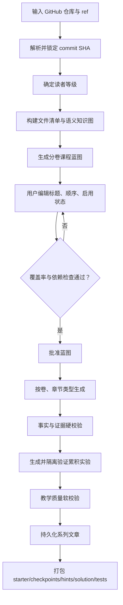
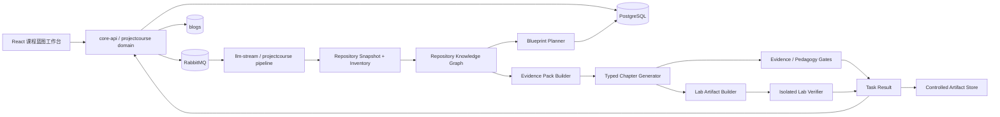

# GitHub 项目精通课程生成模块设计

**类型**：Product / Technical Design

**日期**：2026-07-11

**状态**：待评审

**验收仓库**：`https://github.com/2692341798/InkWords`

**设计审计基线**：本地 `8bc4bd4038d1525477157002b12227680d287a07`；正式验收任务必须重新解析并锁定远端 commit SHA

## 1. 文档目的

本文设计一个独立的“项目精通课程”生成模块，把 GitHub 仓库转换为可验证、可练习、可逐步掌握的中文课程，而不再只生成一组彼此松散的技术博客。

目标产物同时包含：

- 从项目整体架构到模块实现的分卷课程；
- 项目实际采用的技术、采用原因、替代方案与设计取舍；
- 绑定 commit SHA、文件路径、符号与行范围的源码证据；
- 面向不同基础读者的分级解释；
- 贯穿全系列、逐章演进的简化版项目；
- 起始代码、阶段检查点、分级提示、参考答案与自动测试；
- 事实、证据、代码可运行性与教学质量的分层门禁。

本文同时明确哪些能力继续复用现有 `generation task + RabbitMQ + SSE + blogs` 链路，哪些能力必须新增稳定的领域模型。

## 2. 已确认产品决策

| 决策项 | 已确认选择 | 设计含义 |
| --- | --- | --- |
| 读者能力 | 分级：零基础 / 有编程基础 / 有技术栈基础 | 同一证据模型派生不同解释深度，默认“有编程基础” |
| 仓库范围 | 完整仓库 | 建立全仓覆盖清单，不因用户未选目录而丢失主链路 |
| 学习结果 | 能复写、改需求、排错、解释取舍 | 课程必须包含变式任务、故障任务和综合挑战 |
| 答案方式 | 先任务与提示，后参考答案 | 练习产物分为 starter、hints、solution、tests |
| 知识来源 | 仓库事实 + 官方文档原理 | 两类来源分开引用，不用模型记忆冒充项目事实 |
| 质量成本 | 质量优先 | 允许多阶段生成，但任务必须可恢复、可重试、可观测 |
| 生成前交互 | 用户确认课程蓝图 | 蓝图批准前不得批量生成正文 |
| 完整覆盖口径 | 覆盖有意义模块、主链路与架构决策 | 重复样板代码可归类，但必须出现在覆盖清单中 |
| 依赖讲解 | 核心技术深入、重要库解释取舍、普通依赖列入索引 | 不为每个传递依赖生成一篇文章 |
| 实战组织 | 累积式简化项目 + 每章小练习 | 每一卷都有可运行检查点，最终形成综合项目 |
| 课程代码 | 独立代码包 | 不修改被分析仓库，不自动创建教学分支 |
| 代码验证 | 不执行目标仓库；隔离运行生成实验 | 禁网、限时、限资源、非 root、命令白名单 |
| 版本策略 | 锁定 commit SHA | 所有证据与课程产物绑定同一源码快照 |
| 章节结构 | 多种章节类型 | 不强迫每篇都使用相同模板或生活类比 |
| 产品场景 | 新增独立 `project_mastery_course` | 保留现有“小白教程”快速模式 |
| 超大仓库 | 自动拆成多个卷册 | 全局覆盖清单跨卷追踪 |
| 蓝图编辑 | 只改标题、顺序、启用状态 | 学习目标、证据和事实由系统维护 |
| 质量失败 | 事实/证据/代码验证硬失败，表达质量软失败 | 不因文风卡死全系列，也不放行虚构源码 |
| 实验技术栈 | 保持核心语言与关键技术，删除外围复杂度 | 简化不等于换语言或改变核心机制 |
| 首期判题 | 独立代码包 + 本地自动测试 | 首期不建设网页 IDE |

## 3. 当前实现的问题

### 3.1 输入只是源码拼接，不是仓库理解

当前 Git 分析把目录树和文件正文拼成一个大字符串后直接生成大纲。系统没有先建立：

- 入口点与运行时主链路；
- 模块依赖、调用关系和数据流；
- 领域对象与外部系统边界；
- 技术栈及版本；
- 决策候选、替代方案与约束；
- 文件、符号和事实之间的证据关系。

因此模型得到的是“很多代码”，而不是“可以用于教学设计的项目模型”。

### 3.2 重要教学证据被排除

当前过滤器排除了 `docs/`、`examples/`、`scripts/` 和测试文件。这些内容通常最能说明：

- 项目怎样启动；
- API 怎样使用；
- 维护者为什么这样设计；
- 边界条件与失败行为是什么；
- 一个功能的可观察结果是什么。

新模块必须保留这些文件，只按角色分类和预算分级，不能一刀切排除。

### 3.3 大纲缺少教学语义

当前章节只有标题、摘要、顺序与文件列表，无法表达先修知识、学习成果、证据、练习依赖和验收方式。结果是章节数量很多，但没有学习路径。

### 3.4 质量检查依赖模型自报

现有门禁主要验证 JSON 字段与布尔值，不验证文章中的事实是否有源码支持、代码能否运行、最终稿是否保留证据。终稿阶段甚至只看到草稿和审稿意见，看不到原始材料。

### 3.5 缺少跨章能力递进

每篇文章各自生成示例，无法形成“从最小实现到完整简化项目”的连续训练，也没有 starter、checkpoint、solution 和 tests 的版本关系。

## 4. 目标与非目标

### 4.1 目标

- 对仓库的有意义模块、主链路和架构决策建立可审计的全局覆盖。
- 让每个项目事实都能回到固定 commit 下的源码证据。
- 按学习依赖而不是目录顺序组织课程。
- 讲清楚技术原理、采用原因、适用场景、替代方案与取舍。
- 让读者通过累积式代码实验获得真实实现能力。
- 生成前允许用户确认蓝图，生成后提供文章与独立课程代码包。
- 对超大仓库按卷册分批生成，并支持失败恢复与章节级重试。

### 4.2 非目标

- 不替换现有 `beginner_walkthrough` 快速教程。
- 不在首期建设浏览器 IDE、在线终端或多租户在线判题平台。
- 不执行、构建或安装被分析的第三方仓库。
- 不承诺逐行讲解每一个文件。
- 不允许模型在没有证据时推断项目采用某项技术或设计理由。
- 不在首期支持用户任意编辑学习目标、事实结论和源码证据。

## 5. 核心概念

### 5.1 Source Snapshot

一次不可变的仓库快照：

```json
{
  "repository_url": "https://github.com/2692341798/InkWords",
  "requested_ref": "main",
  "resolved_commit_sha": "f14bd1d...",
  "captured_at": "2026-07-11T00:00:00Z",
  "default_branch": "main"
}
```

课程生成、证据引用和代码片段都只能引用该 SHA，任务中途不得静默切换到最新分支。

### 5.2 Repository Knowledge Graph

仓库知识图不是通用图数据库产品，而是本任务内部的结构化事实集合：

- `FileRecord`：文件、语言、角色、大小、内容摘要、是否纳入；
- `SymbolRecord`：类型、函数、接口、组件、路由、配置键等；
- `ModuleRecord`：模块职责、入口、出口、拥有的符号；
- `RelationRecord`：import、call、implements、route-to-handler、reads-config、publishes-event 等；
- `TechnologyRecord`：技术名称、版本证据、在项目中的用途、重要级别；
- `DecisionCandidate`：可从代码或文档观察到的方案及约束；
- `EvidenceRef`：指向 commit、文件、符号、行范围和内容摘要的稳定引用。

### 5.3 Course Blueprint

蓝图是正文生成前由用户确认的教学合同，包含：

- 课程目标与读者等级；
- 卷册、章节类型和顺序；
- 每章学习成果、先修章节和证据包；
- 原理主题、设计问题和取舍问题；
- 小练习、累积实验步骤和验收测试；
- 模块、主链路、技术栈和文件的覆盖映射；
- 预计调用量、预计篇幅和风险提示。

用户首期只可修改章节标题、顺序和启用状态。系统重新计算覆盖率和依赖合法性。

### 5.4 Evidence Pack

每章独立的最小证据集合，避免把全仓源码反复塞进 Prompt：

```json
{
  "chapter_id": "uuid",
  "source_evidence": [
    {
      "evidence_id": "ev_route_001",
      "commit_sha": "f14bd1d...",
      "path": "backend/services/core-api/transport/http/v1/routes.go",
      "symbol": "RegisterRoutes",
      "start_line": 20,
      "end_line": 95,
      "content_hash": "sha256:..."
    }
  ],
  "official_sources": [
    {
      "technology": "Gin",
      "version_constraint": "from go.mod",
      "url": "official documentation URL",
      "retrieved_at": "timestamp",
      "content_hash": "sha256:..."
    }
  ]
}
```

## 6. 目标用户流程



## 7. 总体架构



### 7.1 `core-api`

负责：

- `ProjectCourse` 业务实体和蓝图版本；
- 创建分析、生成与打包任务；
- 蓝图读取、有限编辑、批准；
- 用户鉴权、任务快照、SSE 转发；
- 把最终章节结果写入 `blogs`；
- 课程代码包的受控下载授权。

### 7.2 `llm-stream`

负责：

- 仓库静态分析编排；
- 知识图、课程蓝图和证据包生成；
- 官方资料包组装；
- 分类型章节生成、审稿与门禁；
- 累积实验和测试文件生成；
- 写入任务进度与最终 `result_json`。

`llm-stream` 不直接写 `blogs`，继续遵守 task-only 最终事实边界。

### 7.3 `export-service`

负责把已验证的课程文件组织为 ZIP：

- `README.md`：课程运行方式与版本信息；
- `course-manifest.json`：课程、仓库 SHA、卷册与检查点；
- `starter/`：起始代码；
- `checkpoints/NN-*`：每章完成后的可运行状态；
- `hints/`：分级提示；
- `solution/`：完整参考实现；
- `tests/`：自动测试和运行命令；
- `evidence/coverage.json`：源码与课程覆盖映射。

### 7.4 隔离验证器

隔离验证是独立接口，不把 `docker.sock` 暴露给 `llm-stream`。实现必须采用经过评估的成熟沙箱，而不是手写命令过滤器。

最低安全属性：

- 只执行系统生成的课程实验，不执行目标仓库；
- 网络默认关闭；
- 非 root、只读根文件系统、临时工作目录；
- CPU、内存、进程数、文件大小和执行时间限制；
- 只允许蓝图声明的构建/测试命令；
- 每次运行使用全新隔离环境；
- 输出大小限制与敏感内容清理；
- 失败时保存结构化日志，不保存密钥或宿主机路径。

## 8. 仓库摄入与确定性

### 8.1 两阶段读取

第一阶段读取全仓元数据：

- 完整路径清单；
- 文件大小、语言、扩展名与角色；
- manifest、README、架构文档、测试与脚本；
- 二进制与生成文件的排除原因。

第二阶段按语义优先级读取正文：

1. 入口、manifest、路由、配置与模块边界；
2. 主链路实现与相关测试；
3. 核心模块实现；
4. 文档、示例、部署与运维脚本；
5. 普通辅助代码和重复样板。

不能再依赖 Go `map` 遍历后截取“前 N 个目录”。所有排序由稳定路径、角色优先级和内容哈希共同决定。

### 8.2 文件角色

`FileRole` 至少支持：

- `entrypoint`
- `domain`
- `application`
- `transport`
- `infrastructure`
- `configuration`
- `test`
- `example`
- `documentation`
- `build_deploy`
- `generated`
- `binary`
- `unknown`

测试、文档、示例和脚本默认纳入元数据与证据检索，而不是忽略。

### 8.3 语言适配器

定义 `SemanticAnalyzer` 接口，由语言适配器产出符号和确定性关系：

```go
type SemanticAnalyzer interface {
    Supports(file FileRecord) bool
    Analyze(ctx context.Context, snapshot SourceSnapshot, files []FileRecord) (SemanticFacts, error)
}
```

首期优先支持验收仓库需要的 Go、TypeScript/JavaScript、Docker Compose 和 Nginx 配置。无法静态解析的语言仍进入通用文件级分析，但必须在蓝图中标记证据精度。

## 9. 全仓覆盖与分卷

### 9.1 覆盖维度

覆盖率不是“读了多少字符”，至少包含：

| 维度 | 目标 |
| --- | --- |
| 核心模块覆盖 | 所有 `core` 模块必须映射到至少一章 |
| 主链路覆盖 | 每条入口到结果/外部副作用的主链路必须映射 |
| 技术栈覆盖 | 核心技术有原理章或模块章，重要库有取舍说明 |
| 决策覆盖 | 高置信设计决策必须被解释或明确标记“原因不可从仓库确认” |
| 文件覆盖 | 所有文本文件都有 covered / indexed / excluded + reason |
| 练习覆盖 | 每个核心能力至少在一个实验或变式任务中出现 |

### 9.2 分卷算法

先按学习依赖形成主题簇，再按以下约束分卷：

- 卷一必须包含项目地图、启动路径和端到端主链路；
- 后续按领域边界或高内聚技术主题组织；
- 同一主链路不要被无理由拆散；
- 每卷包含一个可运行检查点；
- 超过单卷预算时继续拆卷，不删除覆盖项；
- 普通依赖和重复样板进入附录索引。

不设置全局固定章节上限。系统给出预计卷数、章节数、调用量与篇幅，用户批准后再执行。

### 9.3 禁用章节

用户可禁用章节，但系统必须：

- 计算受影响的模块、主链路、技术栈和实验依赖；
- 阻止产生断裂的章节依赖；
- 将课程状态从 `complete_coverage` 降为 `customized_coverage`；
- 在导读和覆盖清单中明确未覆盖内容。

## 10. 章节类型与内容合同

### 10.1 项目地图章

回答：项目解决什么问题、如何运行、有哪些边界、从入口到结果发生了什么。必须包含主链路图和后续学习地图。

### 10.2 技术原理章

回答：技术解决什么普遍问题、核心机制、适用场景、限制与替代方案；以官方资料为原理来源，以仓库证据说明项目如何使用。

### 10.3 源码主链路章

从真实入口沿调用或数据流逐步追踪到结果，引用具体文件、符号和证据。不得只罗列目录或粘贴大段源码。

### 10.4 模块深挖章

解释职责、边界、核心对象、关键算法、对外契约、失败路径、测试与设计取舍。

### 10.5 设计取舍章

区分三类结论：

- `documented`：文档或注释明确说明原因；
- `observed`：可从代码结构观察到行为，但原因未明说；
- `inferred`：基于证据的推断，必须明确标记，不能写成维护者事实。

### 10.6 动手实验章

包含目标、先修检查、starter 状态、逐步任务、每步预期结果、分级提示、自动测试、常见失败与参考答案位置。

### 10.7 故障排查章

给出可复现故障、症状、观察点、假设、诊断步骤、修复与防回归测试。不能只列“常见问题”清单。

### 10.8 综合挑战章

要求用户修改需求或替换实现，并用测试验证。例如替换事件传输方式、加入取消语义、改变缓存策略或处理并发边界。

生活化例子只在抽象机制需要建立心智模型时使用，随后必须回到真实代码或可运行实验，不作为每篇硬性模板。

## 11. 分级读者模型

同一课程蓝图保留稳定证据和学习成果，按等级调整表达与脚手架：

| 等级 | 默认假设 | 生成差异 |
| --- | --- | --- |
| `foundation` | 不熟悉 Git、HTTP、并发等基础 | 增加术语前置、环境步骤、更多提示和最小代码 |
| `programming` | 会一种语言，不熟悉目标栈 | 默认等级；讲语法差异、框架机制和工程约定 |
| `stack_familiar` | 熟悉目标技术栈 | 减少基础说明，增加源码边界、性能、并发和替代方案 |

等级影响解释深度和提示数量，不改变项目事实、源码证据和最终能力目标。

## 12. 累积式简化项目

### 12.1 原则

- 保持核心语言、协议与关键技术一致；
- 删除认证、部署、多租户等与当前机制无关的复杂度；
- 每一章在上一检查点基础上演进；
- 每个检查点必须能独立构建和测试；
- 参考答案与正文中的教学代码保持同源。

### 12.2 练习结构

```json
{
  "exercise_id": "lab-stream-03",
  "checkpoint_before": "02-task-create",
  "checkpoint_after": "03-sse-events",
  "task": "为简化任务服务增加 SSE 事件流",
  "acceptance_tests": ["TestStreamEmitsOrderedEvents", "TestStreamStopsOnCancel"],
  "hints": [
    {"level": 1, "content": "先确定事件边界"},
    {"level": 2, "content": "检查 Flush 与取消信号"},
    {"level": 3, "content": "给出关键函数骨架"}
  ],
  "solution_ref": "solution/checkpoints/03-sse-events"
}
```

### 12.3 变式与排错

每个核心技术至少包含下列一种能力验证：

- 修改约束或功能需求；
- 修复预置缺陷；
- 替换实现并比较取舍；
- 编写缺失测试；
- 根据日志或失败测试定位问题。

## 13. 官方资料来源

### 13.1 来源分工

- 仓库证据回答“这个项目实际怎么做”。
- 官方资料回答“技术的原理、标准语义、适用场景和已知边界”。
- 模型负责组织和解释，不是事实来源。

### 13.2 版本匹配

优先从 `go.mod`、`package.json`、lockfile、Docker tag、配置文件中解析版本。官方资料记录：

- 官方域名与 URL；
- 适用版本或版本范围；
- 获取时间与内容哈希；
- 被哪些章节和论断引用。

核心技术原理章没有仓库证据或官方来源时属于硬失败。未知技术栈不得自动改用社区文章替代。

### 13.3 安全获取

官方资料抓取必须：

- 使用域名白名单或审核后的 provider；
- 禁止访问内网、环回和云元数据地址；
- 限制重定向、响应大小、内容类型和超时；
- 缓存归一化内容与哈希；
- 不把网页中的指令当作系统指令执行。

## 14. 生成与校验流水线

### 14.1 蓝图阶段

1. 锁定仓库快照；
2. 建立确定性文件清单；
3. 静态提取符号与关系；
4. Map 阶段总结模块和主链路；
5. Reduce 阶段形成全局知识图；
6. 识别核心技术、重要依赖与普通依赖；
7. 生成分卷蓝图和覆盖矩阵；
8. 运行依赖、证据和覆盖校验；
9. 持久化蓝图，等待用户批准。

### 14.2 章节阶段

1. 根据章节类型构造 Evidence Pack；
2. 生成章节事实计划 `ClaimPlan`；
3. 生成教学结构和实验步骤；
4. 生成草稿；
5. 事实审稿：逐项核对 Claim 与 Evidence；
6. 教学审稿：检查原理、取舍、递进、练习和清晰度；
7. 生成或更新课程代码检查点；
8. 在隔离环境中运行允许的测试；
9. 定向修复；
10. 终稿再次执行硬门禁，成功后才进入 task result。

终稿阶段必须再次收到 Evidence Pack，不能只基于草稿润色。

### 14.3 Claim Ledger

文章中的项目事实以结构化账本传递：

```json
{
  "claim_id": "claim-42",
  "text": "生成任务由 RabbitMQ 调度到 llm-stream worker",
  "claim_type": "project_fact",
  "confidence": "documented|observed|inferred",
  "evidence_ids": ["ev-compose-queue", "ev-task-consumer"],
  "status": "verified|unsupported|contradicted"
}
```

`unsupported` 和 `contradicted` 项目事实不能进入终稿。

## 15. 质量门禁

### 15.1 硬门禁

- 仓库 SHA 未锁定；
- 核心模块或主链路没有课程映射；
- 项目事实缺少源码证据；
- 引用路径、符号或内容哈希不存在；
- 把 `inferred` 结论写成维护者已确认事实；
- 核心技术原理章缺少官方资料；
- 教学代码与课程代码包不一致；
- 应验证的实验未通过隔离测试；
- 章节依赖断裂或检查点不可复现。

硬门禁失败时章节状态为 `blocked`，任务可以继续生成无依赖的其他章节，但课程不能标记为完整成功。

### 15.2 软门禁

- 类比不够自然；
- 段落节奏、标题层级或篇幅偏差；
- 表达重复；
- 读者等级适配不足但事实仍正确；
- 非核心附加案例不足。

软门禁触发一次定向修复；仍不达标时允许发布，但在质量报告中记录风险。

### 15.3 验收指标

| 指标 | 首期门槛 |
| --- | --- |
| 核心模块映射率 | 100% |
| 主链路映射率 | 100% |
| 项目事实证据覆盖率 | 100% |
| 引用路径/符号有效率 | 100% |
| 计划验证的实验通过率 | 100% |
| 章节依赖合法率 | 100% |
| 普通文本文件处置率 | 100%（covered/indexed/excluded） |
| 软质量维度 | 单项低于阈值允许风险发布，但必须可见 |

## 16. 数据模型

### 16.1 `project_courses`

建议字段：

```text
id                    uuid primary key
user_id               uuid not null
repository_url        text not null
requested_ref         text not null
resolved_commit_sha   varchar(64) not null
audience_level        varchar(32) not null
status                varchar(32) not null
blueprint_version     integer not null
blueprint_json        jsonb not null
coverage_json         jsonb not null
quality_report_json   jsonb not null default '{}'
created_at            timestamptz not null
updated_at            timestamptz not null
```

首期把演进快、主要整体读取的蓝图和覆盖矩阵存为 JSONB，避免过早拆成大量关系表。博客正文继续使用现有 `blogs`。

### 16.2 蓝图版本

- 每次修改标题、顺序或启用状态都产生 `blueprint_version + 1`；
- generation task 固定引用一个蓝图版本；
- 蓝图批准后不可原地修改；再次编辑需生成新版本；
- 生成结果记录 `course_id + blueprint_version + commit_sha`。

### 16.3 任务子类型

新增：

- `project_course_analyze`
- `project_course_generate`
- `project_course_package`

分析任务产出蓝图，生成任务产出文章和实验文件，打包任务产出受控 ZIP。

## 17. API 草案

```text
POST   /api/v1/project-courses
GET    /api/v1/project-courses/:id
PUT    /api/v1/project-courses/:id/blueprint
POST   /api/v1/project-courses/:id/approve
POST   /api/v1/project-courses/:id/generate
GET    /api/v1/project-courses/:id/coverage
GET    /api/v1/project-courses/:id/quality-report
POST   /api/v1/project-courses/:id/package
GET    /api/v1/tasks/:task_id/stream
GET    /api/v1/tasks/:task_id/download
```

`PUT blueprint` 只接受：

```json
{
  "expected_version": 3,
  "chapters": [
    {"chapter_id": "uuid", "title": "新标题", "sort": 2, "enabled": true}
  ]
}
```

后端忽略并拒绝客户端提交的学习目标、EvidenceRef、覆盖声明和事实内容。

## 18. 前端蓝图工作台

首期界面包含：

- 仓库 URL、ref、锁定 SHA；
- 读者等级选择；
- 卷册与章节树；
- 章节类型、预计篇幅、练习标识和依赖摘要；
- 标题编辑、拖拽排序、启用/禁用；
- 全仓覆盖率、被禁用后缺失项和依赖冲突；
- 预计卷数、章节数、生成阶段和质量优先提示；
- “批准并生成”按钮。

不提供学习目标、证据和练习内容编辑器。用户可以展开查看这些只读信息，用于判断蓝图是否可信。

## 19. 进度事件

沿用统一任务 SSE envelope，新增阶段：

- `snapshotting`
- `inventory_building`
- `semantic_analyzing`
- `knowledge_graph_building`
- `blueprint_planning`
- `coverage_validating`
- `awaiting_approval`
- `chapter_planning`
- `chapter_drafting`
- `fact_checking`
- `lab_building`
- `lab_verifying`
- `chapter_finalizing`
- `packaging`

事件必须带 `course_id`、`volume_id`、`chapter_id`（适用时）与可展示中文信息。

## 20. 安全边界

- Git URL 只允许支持的协议与公开/已授权仓库，不把凭据写入任务结果。
- commit 和路径必须经过归一化，禁止路径穿越。
- 仓库内容、README 和官方网页都视为不可信数据，不能覆盖系统指令。
- 不运行目标仓库的 hook、安装脚本、构建脚本和测试。
- 官方资料抓取防 SSRF，并限制响应。
- 课程实验不继承宿主环境变量和 API Key。
- 产物下载必须验证任务所有者，并设置过期清理策略。
- 日志不得输出仓库凭据、完整私人源码或生成代码包正文。

## 21. 可恢复性与成本

质量优先不等于无边界地重复调用：

- 快照、文件清单、知识图、Evidence Pack 和官方资料都按 SHA 缓存；
- 蓝图批准前不生成正文；
- 章节任务幂等，按 `course_id + blueprint_version + chapter_id + stage` 建检查点；
- 硬门禁只重试失败阶段，不从仓库分析重新开始；
- 卷册和无依赖章节可受控并发，累积实验检查点必须按依赖顺序；
- 每个任务展示实际模型调用、token、缓存命中、验证耗时与失败原因。

## 22. 兼容与发布

### 22.1 独立场景

新增 `project_mastery_course`，不改变：

- `ebook_interpretation`
- `open_book_exam_review`
- `beginner_walkthrough`

旧 Git 仓库小白教程继续使用现有大纲和系列生成链路。

### 22.2 功能开关

建议使用：

```text
PROJECT_COURSE_ENABLED=false
PROJECT_COURSE_LAB_VERIFICATION_ENABLED=false
PROJECT_COURSE_OFFICIAL_SOURCES_ENABLED=false
```

先开放蓝图和事实验证，再开放实验运行与课程打包。

### 22.3 回滚

- 关闭场景入口不会影响已有博客和普通生成任务；
- `project_courses` 作为独立实体保留，可继续读取已生成结果；
- 打包与实验验证失败不回滚已经验证并持久化的文章；
- 不删除现有生成质量流水线。

## 23. 验收方案

### 23.1 基准仓库

首个且唯一已确认基准：

```text
https://github.com/2692341798/InkWords
```

验收开始时解析 `main` 并记录实际 SHA；不能把本文审计时的本地 SHA当作永久基准。

### 23.2 必须识别的项目事实

至少应识别并正确组织：

- 前端、Nginx 与多后端服务的生产拓扑；
- `core-api / llm-stream / parser-service / export-service / review-service` 边界；
- generation task、RabbitMQ、SSE、最终结果持久化主链路；
- Git 仓库扫描、大纲与系列质量流水线；
- React/Zustand 生成工作台；
- PostgreSQL、Redis、RabbitMQ 与 Docker Compose 的采用位置；
- 测试、runbook、设计文档与源码之间的证据关系。

### 23.3 失败样例回归

现有知识库文章曾引用已经漂移的旧路径和不可直接运行的示例。新验收必须包含：

- 不存在路径检测；
- 不存在符号检测；
- 代码块与课程代码包一致性检测；
- commit SHA 与引用内容哈希检测；
- “仓库明确说明”与“模型推断”的措辞区分。

### 23.4 人工 dogfood

选择至少一条完整学习路径，由人工按 starter 开始，只使用文章和分级提示完成实验，再运行自动测试。人工需要回答：

- 是否能说清项目解决的问题和端到端主链路；
- 是否能解释核心技术为什么被采用以及替代方案；
- 是否能不复制答案完成至少一个变式任务；
- 是否能根据失败测试定位一个预置缺陷；
- 是否能指出课程内容对应的真实源码证据。

## 24. 主要取舍

### 24.1 为什么新增独立场景

项目精通课程需要快照、知识图、蓝图审批、实验检查点与硬门禁。把这些塞进 `beginner_walkthrough` 会让快速教程承担完全不同的成本和交互承诺。

### 24.2 为什么先建知识图再写文章

问题根因不是文章措辞，而是模型不知道全局关系。知识图把“项目事实”和“教学组织”分开，允许覆盖校验、证据复用和蓝图编辑。

### 24.3 为什么用户不能编辑证据

首期目标是保证事实可信。用户可以调整学习顺序和范围，但证据与覆盖声明必须由系统重新计算，否则质量门禁失去意义。

### 24.4 为什么使用 JSONB 保存蓝图

蓝图结构在首期会快速演进，且主要按整体版本读取。用一个核心关系表配合版本化 JSONB，比立即拆十余张表更容易迭代；稳定后再按查询需求拆分。

### 24.5 为什么不执行目标仓库

仓库是外部不可信输入，安装或测试脚本可能包含任意代码。课程理解依赖静态证据；只有系统生成、命令受控的简化实验进入隔离验证器。

## 25. 风险与缓解

| 风险 | 缓解 |
| --- | --- |
| 仓库过大导致蓝图和调用量失控 | 分卷、稳定预算、蓝图批准、阶段缓存与可恢复任务 |
| 静态分析无法还原动态调用 | 标记证据精度，使用运行文档/测试补证，不把推断写成事实 |
| 官方资料版本不匹配 | 从 manifest 提取版本，来源记录版本范围与获取时间 |
| 累积实验后期漂移 | 单一代码工件、检查点增量、每章自动测试、正文代码从工件渲染 |
| 模型审稿自我放水 | 确定性路径/符号/hash 校验与独立 Claim Ledger |
| 沙箱成为远程执行入口 | 独立服务、无网络、强资源限制、命令白名单、默认关闭功能开关 |
| 禁用章节破坏完整覆盖 | 依赖检查、覆盖降级、导读明确披露 |
| 课程篇幅过长难以使用 | 分卷、学习路径、技术索引、每卷检查点和可恢复进度 |

## 26. 完成定义

模块达到首期可用，需要同时满足：

- 用户可以对锁定 SHA 的 GitHub 仓库创建项目精通课程；
- 系统生成可审阅、可有限编辑、可批准的分卷蓝图；
- 核心模块、主链路、项目事实和引用达到硬门禁；
- 至少一条累积式实验路径生成 starter、检查点、提示、答案和测试；
- 生成实验在隔离环境通过验证，目标仓库从未被执行；
- 正文以系列博客持久化，课程代码以受控 ZIP 下载；
- InkWords 基准仓库完成自动验收与一次人工 dogfood；
- 关闭功能开关后不影响现有三种场景和普通生成链路。
