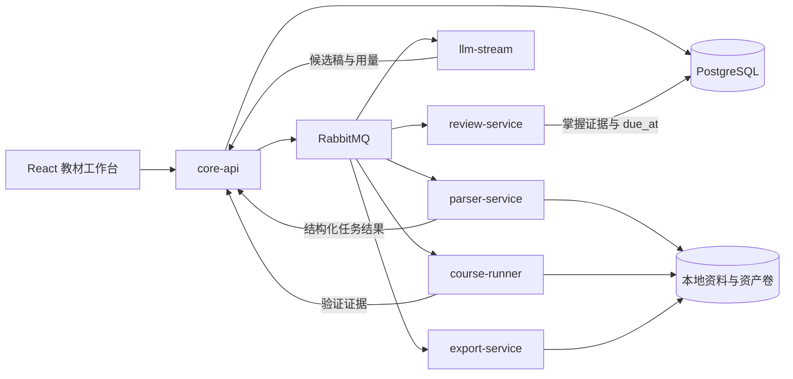

# InkWords 教材平台开发设计文档

> 日期：2026-09-02
>
> 状态：V1 开发基线，待按阶段实施
>
> 对应 PRD：`.trae/documents/InkWords_PRD.md`
>
> 关系：本文取代旧 Project Mastery Course 文档的产品方向，但保留其已经实现并验证的源码快照、证据、蓝图、质量门禁、实验包和任务编排能力。

## 1. 结论先行

InkWords 不应推倒重写，也不应在旧“系列博客”旁边再堆一套平行教材功能。V1 采用渐进式领域重构：

1. 将现有 `projectcourse` 升级为教材核心域，教材母稿成为唯一正文事实源；
2. 将博客、出版稿、视频教案和学习任务改为母稿的派生视图；
3. 沿用 RabbitMQ、任务表、SSE、固定 Git SHA、EvidenceRef、Claim Ledger、质量门禁和课程包；
4. 在现有 parser-service 内新增有边界的官方文档栈抓取，不新建爬虫微服务；
5. 在现有 review-service 内引入确定性的 FSRS 调度，不让 LLM 直接决定复习日期；
6. 在现有 export-service 内加入 DOCX 产线，不新建出版服务；
7. 通过端口和适配器统一 DeepSeek/OpenAI，不让业务层依赖某家请求结构；
8. 先交付 Gin 样章的纵向闭环，再扩成整本书。

首个里程碑不是“所有 P0 表和页面都建好”，而是用固定 Gin 资料生成、验证、审批、学习并导出一章真实样章。之后每个迭代都扩展同一条链路。

## 2. 现有源码基线

### 2.1 可以直接保留的能力

| 能力 | 现有位置 | 处理 |
| --- | --- | --- |
| 固定 Git 提交和文件清单 | `backend/services/llm-stream/app/projectcourse/snapshot_service.go`、`inventory.go` | 保留并泛化为 SourceSnapshot |
| Go/TypeScript/配置语义分析 | `backend/services/llm-stream/app/projectcourse/analyzer_*.go` | 保留，作为代码类资料适配器 |
| 蓝图、覆盖矩阵、学习目标 | `backend/shared/kernel/projectcourse/blueprint.go`、`coverage.go` | 扩展，不复制模型 |
| 来源证据与 Claim Ledger | `backend/shared/kernel/projectcourse/evidence.go`、`claim_ledger.go` | 扩展到网页和文件定位 |
| 章节合同与硬门禁 | `chapter_contracts.go`、`quality_gates.go` | 重构为教材质量策略 |
| 任务队列、取消、SSE、结果复用 | core-api task 域、llm-stream TaskConsumer | 保留 |
| 课程实验工件与 ZIP | `lab_builder.go`、export-service `course_package.go` | 保留并扩展 |
| Markdown 编辑、语音转文字 | frontend Editor 与 `useSpeechRecognition.ts` | 复用 |
| 复述会话和内容反馈 | review-service | 扩展为多类型掌握证据 |
| PDF 与 Obsidian 导出 | export-service | 保留，改为母稿投影 |

### 2.2 当前实现与新 PRD 的差距

| 问题 | 源码证据 | 目标变化 |
| --- | --- | --- |
| Course 只能接收一个 GitHub URL/ref | ProjectCourse model、DTO、`ProjectCourse.tsx` | 支持一主多辅的 Git/官网/本地文件 Source |
| 正文仍归档到 blogs | ProjectCourse 模型注释及结果持久化 | 建立 Manuscript/Chapter/Revision，Blog 变为投影 |
| 只有一次蓝图批准 | `BlueprintWorkspace.tsx` 的 approve 后直接生成 | 增加“蓝图批准”和“样章批准”两个门禁 |
| 官方资料只抓单页 | `official_sources.go` | 增加 sitemap/链接发现、范围、预算和缺失报告 |
| 文件被合并为长字符串 | `archive_parser.go` | 保存逐文档结构、定位和内容哈希，不再抹平边界 |
| DOCX 解析只去除 XML 标签 | `doc_parser.go` | 建立 Parser 端口，低质量时失败或走可选高级适配器 |
| 模型层直接暴露 DeepSeek 类型 | `shared/platform/llm/deepseek.go` | 业务端口 + DeepSeek/OpenAI 适配器 |
| 章节生成仅约 2500 tokens 的轻量 JSON | `chapter_generation.go` | 拆分事实计划、教学设计、正文与审校，按阶段控制预算 |
| Review 只有 reading/recalling/coaching | review model | 增加解释、补全、复现、迁移、诊断、保持证据 |
| 今日推荐只是未复习优先/最久未复习 | `review/picker.go` | 使用 FSRS due_at 和掌握维度 |
| 鉴权横跨所有服务 | AuthMiddleware、UserID、前端 Login | 迁移为固定 LocalWorkspaceContext |
| bubblewrap 在当前 Compose 下不可用 | QA 报告和 sandbox ADR | 先完成隔离执行器 spike，失败时严格标未验证 |
| PDF 导出是博客 HTML 打印 | export-service `pdf.go` | 从母稿渲染，并补 DOCX、引用和完整性报告 |

### 2.3 不进行大爆炸式微服务合并

当前服务边界已经有架构测试约束，且长任务通过 RabbitMQ 与浏览器连接解耦。V1 保留以下进程：

- core-api：业务事实、审批、母稿、资料目录和设置；
- parser-service：抓取与解析 worker；
- llm-stream：模型任务 worker；
- course-runner：生成代码验证；
- review-service：学习评测与调度；
- export-service：格式转换与打包；
- frontend：教材项目、工作台、学习和设置。

不再新增 ingestion、RAG、publishing、screenshot 等独立服务。只有当一个进程出现独立扩缩容、权限边界或故障隔离证据时，才重新评估拆分。

## 3. 开源项目与成熟组件调研

调研日期为 2026-09-02。引入前必须在实际开发 PR 中再次确认版本、许可证、维护状态、镜像体积和安全公告。

### 3.1 是否存在可以直接改造的完整项目

| 项目 | 可借鉴能力 | 结论 |
| --- | --- | --- |
| [rsml/tutor](https://github.com/rsml/tutor) | 先目录后首章、阅读后测验、根据表现适配、BYOK、端口适配器和契约测试 | 产品概念最接近，但社区规模很小且为 GPL-3.0；只借鉴交互和架构思想，不复制代码 |
| [DocsGPT](https://github.com/arc53/DocsGPT) | 多格式资料、URL/GitHub 摄取、引用、多个模型和本地 Docker | 成熟且 MIT，但目标是企业问答/Agent，Python/Flask 架构与 InkWords 不同；借鉴 ingestion manifest 和 citation UX |
| [RAGFlow](https://github.com/infiniflow/ragflow) | 深文档理解、可视化切分、引用和多路召回 | 能力成熟但本地要求较高、依赖和运维面过大；V1 不嵌入、不部署 |
| [Open edX](https://github.com/openedx/openedx-platform) | 成熟 CMS/LMS、课程结构和学习交付 | 面向大规模在线教学且官方也说明安装复杂；不适合单用户本地工具 |

结论：没有可直接 fork 后低成本满足本 PRD 的成熟项目。InkWords 已有证据驱动课程链路，继续演进的成本和风险低于替换整套技术栈。

### 3.2 建议复用的组件

| 能力 | 候选 | 决策 |
| --- | --- | --- |
| 官方文档站抓取 | [gocolly/colly](https://github.com/gocolly/colly)，Apache-2.0 | 建议采用；支持 robots、限速、并发、缓存，且与 Go parser-service 同栈 |
| 复杂 PDF/DOCX 理解 | [Docling](https://github.com/docling-project/docling)，MIT | 先做独立适配器 spike；只有复杂版式/OCR夹具明显优于现有解析且资源可接受时才加入 Compose |
| 间隔复习 | [open-spaced-repetition/go-fsrs](https://github.com/open-spaced-repetition/go-fsrs)，MIT | 建议采用；review-service 保存卡片和日志，业务评分映射为 FSRS grade |
| Markdown→DOCX | [jgm/pandoc](https://github.com/jgm/pandoc)，GPL-2.0 | 建议作为 export-service 内的独立 CLI 工具；固定镜像版本，分发前复核许可证义务 |
| 数据库迁移 | [pressly/goose](https://github.com/pressly/goose) | 建议采用嵌入式 SQL migrations，逐步取代生产启动时仅依赖 GORM AutoMigrate |
| 容器集成测试 | [testcontainers-go](https://github.com/testcontainers/testcontainers-go) | 只用于需要真实 PostgreSQL/RabbitMQ 的合同和迁移测试，不替代单元测试 |

### 3.3 教材结构的证据来源

- [IES/WWC 学习组织指南](https://ies.ed.gov/ncee/wwc/PracticeGuide/1)：间隔学习、例题与练习交替、图文结合、抽象与具体结合、主动提取和深层解释问题；
- [BCcampus Textbook Outline](https://opentextbc.ca/selfpublishguide/chapter/textbook-outline/)：先确定受众与大纲，章节含学习目标、练习、术语、总结、资源与引用；
- [BCcampus Five Rules of Textbook Development](https://opentextbc.ca/selfpublishguide/chapter/textbook-development/)：显式知识框架、稳定命名、控制新元素数量、层级和有设计的重复；
- [BCcampus Peer Review](https://opentextbc.ca/selfpublishguide/chapter/peer-review/)、[Copy Edit](https://opentextbc.ca/selfpublishguide/chapter/how-to-copy-edit/) 与 [Proofread](https://opentextbc.ca/selfpublishguide/chapter/how-to-proofread/)：区分学科审读、文字编辑和排版后校对，使用明确 rubric 与 StyleSheet；
- [OpenStax College Algebra Preface](https://openstax.org/books/college-algebra/pages/preface)：学习目标、叙事、worked example、Try It、分级练习、章节复习和答案；
- [CAST UDL 3.0](https://udlguidelines.cast.org/representation/language-symbols/vocabulary-symbols-structure/)：解释词汇/符号/结构、多种表达方式、渐进支持、及时反馈与进度反思；
- 中国大陆[《出版管理条例》](https://xzfg.moj.gov.cn/front/law/detail?LawID=1745)、[《中华人民共和国著作权法》](https://www.npc.gov.cn/c2/c30834/202011/t20201119_308796.html)、[《图书质量管理规定》](https://www.nppa.gov.cn/xxgk/fdzdgknr/zcfg_210/bmgz_213/202112/P020221115775549635118.pdf)及国家标准全文公开系统：用于出版候选原稿的版本化预检，不能由应用宣称替代出版单位或法律判断。

这些来源决定“章节合同和质量门禁”，而不是每次请求都全文注入提示词。

## 4. 目标领域架构



### 4.1 限界上下文

#### Source

负责资料声明、固定快照、抓取范围、逐文档解析、切分、定位、许可证和证据索引。不知道教材章节如何写。

#### Textbook

负责教材项目、读者档位、蓝图、章节、母稿修订、批准、锁定和派生视图。不直接联网，不直接调用厂商 SDK。

#### Generation

负责按任务组装证据包、调用模型、解析结构化输出、记账和质量检查。只返回候选结果，不拥有母稿最终状态。

#### Verification

负责系统生成代码的隔离执行、运行记录和浏览器证据。不能执行导入仓库，不能批准章节。

#### Learning

负责学习目标、题目、作答、评分、提示、掌握证据和复习调度。引用母稿，不复制整章正文。

#### Publishing

负责从指定的已批准母稿修订生成 Markdown、博客、视频教案、DOCX、PDF 和 ZIP。不能改写母稿。

### 4.2 依赖规则

- transport → application → domain；
- application 只依赖本域 port 和 shared kernel contract；
- adapter 实现 port，可依赖网络、数据库、文件系统或厂商 SDK；
- 服务不得 import 其他服务的包，跨服务仅使用版本化消息/API contract；
- shared/kernel 只放跨进程稳定值对象和事件，不放数据库 repository 或业务 service；
- frontend page 只编排 feature，API 调用放 service，复杂状态放 store，语音逻辑继续放 hook。

现有 `backend/services/architecture_test.go` 必须扩展这些规则，不能靠代码评审记忆。

## 5. 数据与合同设计

### 5.1 核心实体

| 实体 | 关键字段 | 所有者 |
| --- | --- | --- |
| Workspace | id、name、created_at | core-api |
| TextbookProject | id、workspace_id、title、audience、status、primary_source_id、approved_blueprint_revision_id | core-api |
| Source | id、project_id、kind、role、locator、official_status、license_status | core-api |
| SourceSnapshot | id、source_id、resolved_version、content_hash、captured_at、status、limits_json | core-api |
| SourceDocument | id、snapshot_id、canonical_locator、title、media_type、content_hash、parent_id、artifact_path | core-api |
| SourceChunk | id、document_id、ordinal、heading_path、locator_json、text_hash、search_text | core-api |
| EvidenceRef | id、snapshot/document/chunk、path/url、symbol、line/page/heading、content_hash、confidence | shared contract |
| BlueprintRevision | id、project_id、number、document_json、status、created_at | core-api |
| BookContractRevision | id、project_id、number、audience_model_json、knowledge_graph_json、chapter_profiles_json、environment_json、status | core-api |
| StyleSheetRevision | id、project_id、number、terminology_json、language_json、code_json、visual_json、citation_json、publication_profile_json、status | core-api |
| Chapter | id、project_id、sort、title、type、locked_revision_id、status | core-api |
| ChapterRevision | id、chapter_id、kind、markdown、document_json、content_hash、status、created_by | core-api |
| Asset | id、project_id、chapter_id、kind、artifact_path、hash、caption、alt_text、status | core-api |
| CodeArtifact | id、revision_id、kind、language、entrypoint、source_tree_path、source_ref、manifest_json、limitations_json、hash、status | core-api/course-runner |
| VerificationRun | id、revision_id、environment_json、command_json、result_json、status | core-api |
| QualityAssessment | id、scope_type、scope_id、contract_version、detector、dimension_scores_json、findings_json、status | core-api |
| EditorialReview | id、book_build_id、stage、reviewer_kind、findings_json、decision、created_at | core-api |
| ReaderTrial | id、revision_id、audience_profile_json、environment_json、events_json、completion_json、findings_json | core-api |
| RightsItem | id、project_id、asset/evidence_id、work_type、rights_basis、allowed_use、attribution、publication_status | core-api |
| BookBuild | id、project_id、book_contract_revision_id、style_sheet_revision_id、manifest_json、status、created_at | core-api/export-service |
| LearningObjective | id、chapter_id、text、mastery_requirements_json | review-service |
| MasteryAttempt | id、objective_id、mode、rubric_json、score_json、evidence_json、created_at | review-service |
| ReviewCard | objective_id、fsrs_card_json、due_at、last_grade、updated_at | review-service |
| ModelUsage | task_id、project_id、chapter_id、provider、model、input/output/cache tokens、estimated/actual cost | core-api |

### 5.2 Markdown 与结构化 JSON 的分工

- Markdown 是作者编辑和出版的正文格式；
- document_json 保存稳定内容块语义：场景、类比、机制、步骤、代码、观测、练习、答案、复述、来源；
- Markdown 与 document_json 必须属于同一个 ChapterRevision，并共享 content_hash；
- 博客、视频教案和学习卡片从 document_json 投影，不能持有可独立编辑的正文副本；
- 需要自由写作时使用 custom block，避免为了 schema 完整而丢失作者表达。

`CodeArtifact.kind` 至少区分：`teaching_implementation`（从零实现的可执行教学源码）、`integration_example`（使用成熟组件的实际配置或调用）和 `upstream_walkthrough`（固定版本的官方/主资料源码定位）。三者共享概念映射，但不能互相冒充。教学实现必须携带省略项和“非生产用途”声明；上游源码讲解必须携带 EvidenceRef 与许可证信息。

BookContractRevision 冻结读者已知/未知知识、全书承诺、概念/先修 DAG、贯穿项目状态、章节类型、认知负荷与篇幅预算。StyleSheetRevision 冻结术语、语气、标点、数字、单位、代码、图表、引用和出版社配置。ChapterRevision、QualityAssessment、BookBuild 和导出缓存键都必须包含这两个版本；合同变化时通过依赖图精确标记待重审内容。

### 5.3 场景化叙事合同

零基础章节的 ScenarioFrame 至少包含：

- situation：真实任务环境；
- trigger：出现了什么问题；
- consequence：不处理会造成什么可理解的后果；
- analogy：生活化类比；
- mapping：类比元素与技术概念的对应；
- mechanism：准确机制；
- boundary：类比在哪些地方会失真；
- demonstration_id：用于验证该机制的代码或操作步骤。

示例：“两个粉刷匠反复覆盖同一堵墙”可以映射到同一区域发生不兼容修改；mechanism 必须说明 Git 是发现差异、尝试合并并在必要时要求人工解决，而非阻止同时编辑。质量门禁拒绝只有类比、没有机制和边界的章节。

### 5.4 自学性与自然学习节奏合同

章节不以固定十二段文本建模，而是由 ChapterProfile 选择必需 block。V1 支持 `concept`、`hands_on`、`source_walkthrough`、`project_iteration`、`troubleshooting`、`integration_review`、`reference`。reference 不能作为新概念的唯一首次教学位置。

主学习路径使用 LearningArc：

```text
activate_prior_knowledge
→ experience_problem
→ preview_whole
→ worked_example
→ guided_practice
→ fade_scaffolding
→ independent_transfer
→ explain_and_connect
→ spaced_interleaved_retrieval
→ adapt_from_evidence
```

每个阶段记录目标、所需前置、允许提示级别、成功证据和失败后的补救路由。系统不声称存在适用于所有人的固定“自然曲线”；LearningArc 是默认教学顺序，具体步幅由 ReaderModel 根据正确率、提示次数、耗时、错误类别和复述质量调整。

生成合同同时包含：

- `new_concepts`：本节首次引入的核心概念，默认建议 4–6 个，超出需分组、拆节或说明不可拆理由；
- `hidden_prerequisite_check`：命令、环境、权限、目录、版本和术语是否在使用前交代；
- `scaffolding_level`：完整示范、局部补全、弱提示、仅目标；
- `simplification_ledger`：早期心智模型省略了什么、何时补充，禁止以错误换简单；
- `recovery_path`：每个高概率失败现象对应检查方法和返回主线的条件；
- `plain_language_map`：专业词首次出现前的通俗解释、准确术语、例子/反例和近义概念辨析。

Language detector 标记循环定义、未展开缩写、连续术语密集段、“显然/很简单/不再赘述”等遮蔽跳步的表达、无主体操作、过长步骤和只有代码没有解释的内容。detector 只提出证据化缺陷，不机械按句长或术语数量改写正确内容。

### 5.5 修订与防覆盖

- 草稿编辑每次自动保存产生轻量 revision 或增量快照；
- AI 重生成永远创建 candidate revision；
- apply-candidate 使用 compare-and-swap，提交时校验当前 locked_revision_id/content_hash；
- 已批准或人工编辑的 revision 默认 locked；
- 批量生成只选择没有锁定终稿的章节；
- V1 不建立分支图，只保留线性修订和候选差异。

## 6. 资料抓取与解析设计

### 6.1 任务流程

1. core-api 创建 Source 和 SourceSnapshot 占位，发布 source.ingest.requested；
2. parser-service 校验 URL/文件、预算和类型；
3. Git 使用现有 fetcher 固定 SHA；官网优先 sitemap，再按导航链接 BFS；
4. 每个文档独立解析、规范化和哈希，写入本地 artifact volume；
5. worker 返回 manifest，不直接写 core-api 业务表；
6. core-api 幂等消费结果并写 SourceDocument/Chunk；
7. 完成后生成覆盖、失败和被排除清单。

### 6.2 CrawlerPort

Colly 适配器必须由 Policy 驱动：

- allowed_domains、allowed_path_prefixes；
- max_pages、max_depth、max_page_bytes、max_total_bytes；
- max_concurrency、request_delay、timeout、redirect_limit；
- allowed_media_types；
- robots 行为；
- canonical URL 规则和 query allowlist；
- stop reason 与遗漏报告。

所有 DNS 解析和重定向都重复做 SSRF 校验。HTML 中的文字一律作为数据，不得改变系统提示、抓取策略或执行命令。

V1 不使用浏览器渲染型爬虫。遇到纯 JavaScript 文档站时明确标记 unsupported_rendering，并允许用户改用官方 sitemap、静态导出或本地文件。

### 6.3 ParserPort

统一输出 ParsedDocument：

- blocks：heading、paragraph、code、table、image、list；
- location：页码、段落、标题路径或源行；
- assets：图片和附件；
- warnings：乱码、OCR 未启用、表格降级、内容截断；
- quality_score 和 content_hash。

现有 PDF/DOCX/Markdown/TXT 适配器先进入该接口。Docling 只作为可选适配器 spike，不把 Python 数据结构泄露到业务合同。

### 6.4 ZIP 防护

在现有路径穿越防护上补充：

- 压缩前大小、解压后累计大小和压缩比；
- 文件数、目录深度、单成员大小；
- symlink、device、加密 ZIP 和嵌套压缩包策略；
- 每个 entry 使用 LimitReader，禁止先 io.ReadAll 整个超大 ZIP；
- 所有忽略和失败都进入 manifest。

## 7. 检索、证据与 Token 设计

### 7.1 V1 不引入独立向量数据库

源码教学高度依赖路径、符号、标题、版本和主链路。V1 先实现可解释检索：

1. 蓝图声明章目标、技术和覆盖对象；
2. 用 path/symbol/heading/关键词召回候选；
3. 按来源角色、结构邻近、依赖图和内容新鲜度排序；
4. 对候选去重并控制每类证据预算；
5. 生成 EvidencePack，记录选中和被截断原因；
6. 真实 Gin 验收若证明召回不足，再以 Retriever port 加入 embedding/reranker。

### 7.2 缓存键

统一 CacheKey：

```text
sha256(
  stage_contract_version
  + source_snapshot_hashes
  + blueprint_revision_hash
  + book_contract_revision_hash
  + style_sheet_revision_hash
  + chapter_or_objective_id
  + audience_profile_version
  + provider
  + model
  + generation_options
  + evidence_pack_hash
)
```

缓存不含 API Key。人工正文修改只使依赖该正文的审校、派生视图和验证缓存失效，不使资料解析与无关章节失效。

### 7.3 提示词分层

- system：短且稳定的安全、证据和输出合同；
- developer/domain contract：教材章节结构、场景化叙事与质量 rubric；
- user/task：本章目标、读者档位和操作；
- evidence：有编号、定位和预算的证据包；
- prior approved style：从 StyleSheetRevision 按当前任务投影出的短样式合同，不重复发送整章或无关规则。

遵循 OpenAI Docs 的方向：每条规则只表达一次、只暴露当前阶段所需工具、用代表性 eval 比较质量/Token/延迟/成本。不能仅因调用次数下降就宣称优化成功。

### 7.4 模型用量

内部统一 Usage：

- provider/model/request_id；
- input_tokens、output_tokens、reasoning_tokens（若提供）；
- cached_input_tokens、cache_write_tokens（若提供）；
- estimated_cost、actual_cost、currency、pricing_snapshot；
- latency、retry_count、finish_reason。

不同厂商没有的字段保持 null，不伪造为 0。费用表由本地配置更新，历史记录保留当时 pricing_snapshot。

## 8. 模型 Provider 架构

定义 GenerationPort，不让领域层引用 DeepSeek ChatRequest：

```go
type GenerationPort interface {
    Generate(ctx context.Context, request GenerationRequest) (GenerationResult, error)
    Stream(ctx context.Context, request GenerationRequest, sink ChunkSink) (GenerationResult, error)
    Capabilities(ctx context.Context, model string) ModelCapabilities
}
```

GenerationRequest 使用内部 Message、OutputSchema、ReasoningProfile、TokenBudget、CachePolicy 和 SafetyContext。适配器负责：

- DeepSeek Chat Completions；
- OpenAI Responses API；
- provider 特有 structured output、stream event、usage 和错误归一化。

模型选择由 TaskModelPolicy 配置，不允许业务代码散落模型名。默认策略只给建议，真正使用的 provider/model 在任务创建页可见。

API Key：

- 环境变量继续作为初始配置；
- 设置页只显示已配置/末四位，不回传完整密钥；
- UI 写入时走 localhost HTTPS/HTTP 到 core-api，日志和错误必须脱敏；
- 持久化密钥使用本地 master key 加密；若没有 master key，只允许 session-only；
- 威胁模型明确：这防止日志、数据库备份和导出误泄漏，不防止已经控制本机账户的攻击者。

## 9. 教材生成与质量流水线

### 9.1 蓝图阶段

输出结构化 BlueprintRevision、BookContractRevision 和 StyleSheetRevision：目标读者的已知/未知/易错知识、全书承诺、概念与章节 DAG、ChapterProfile、每章成果、贯穿项目状态、认知负荷与篇幅预算、证据覆盖、验证计划、练习矩阵、语言/术语/图表/引用规范、视频工具和成本估算。未批准时只能预览或编辑允许字段。

### 9.2 样章阶段

用户批准蓝图后选择一章作为完整样章，并为完整样章未覆盖的主要 ChapterProfile 生成短篇风格探针：

1. EvidencePack；
2. ClaimPlan；
3. ScenarioFrame 与教学设计；
4. 草稿；
5. 代码工件；
6. 运行验证与截图清单；
7. 技术审校；
8. 教学审校；
9. candidate revision；
10. 人工批准并形成 StyleSheetRevision。

样章未批准时，API 拒绝 batch generation，而不是只在前端禁用按钮。

### 9.3 普通章节阶段

每章独立运行同一流水线。事实/证据/代码为硬门禁；表达与建议为可人工接受的软门禁。任何失败都保留已完成 checkpoint，并允许从最近的输入哈希一致 checkpoint 恢复。

正文生成按 LearningArc 编排，但最终文章不得暴露内部 schema 或产生十段同构套话。生成顺序是先完成主线最小闭环，再按真实需要加入机制、源码、性能和边界。练习按照 worked example → completion → weak hint → independent task → transfer 逐步撤除脚手架，并将答案与首次作答视图隔离。

每个核心技术点持久化 `UnderstandingChain`，用于约束生成、审校和学习任务：

```text
UnderstandingChain
├── need: 为什么出现这项技术，旧做法的限制是什么
├── problem: 它解决的具体问题、约束与不用它的失败基线
├── alternatives: 主流实现层次/路线、机制差异、代价与选型依据
├── usage: 最小可运行用法、输入输出、适用前提
├── mechanism: 操作如何沿组件/数据结构/协议/运行时产生结果
├── observation: 可以实际看到的日志、文件、调用链、网络或资源证据
├── tradeoffs: 成本、边界、常见误用与替代方案
└── assessment: 解释、实作、迁移和排错任务
```

`UnderstandingChain` 不是让模型重复生成七段套话。蓝图阶段先为每章列出问题演进和失败基线；正文阶段把它自然编排进场景、示例与原理；审校阶段检查逻辑闭环。对于 Git，可用“误删代码”建立 need，用未提交/已提交等不同失败状态限定 problem，用实际命令体现 usage，再通过工作区、暂存区、对象与引用的变化解释 mechanism。对于 Web 请求，可用开发者工具的请求瀑布、Header、状态码和耗时证明 observation。

架构类主题也使用相同合同。例如负载均衡章节的失败基线是单实例在并发增长和进程故障下的延迟、错误率及不可用；alternatives 至少比较 DNS/全局流量调度、L4 NAT/DR/TUN 或代理、L7 反向代理、客户端负载均衡和服务网格，并解释它们分别在域名解析、传输层、应用层或调用方工作；usage 是启动带不同实例标识的多个后端并完成一种最小实现；mechanism 应覆盖轮询、加权、最少连接、哈希/一致性哈希、连接行为、主动或被动健康检查以及故障摘除；observation 使用各实例访问日志、请求分布、吞吐量、延迟分位数和故障切换时间；tradeoffs 必须覆盖 DNS 缓存与传播延迟、有状态会话、重试放大、共享下游瓶颈、代理自身容量与单点问题。质量检查不能因为出现了配置片段或“提高性能”等结论就判定讲解完整。

### 9.4 自动门禁

- Evidence gate：关键 claim 有可定位证据；
- Citation gate：引用 hash、快照和定位仍匹配；
- Scenario gate：零基础章节有真实场景、映射、机制和类比边界；
- Understanding gate：每个核心技术点完整回答为什么需要、解决什么、有哪些实现路线、如何使用、为何有效及何时不适用，并包含失败基线、方案比较和底层观测；
- Self-study gate：没有隐藏前提、循环定义、术语墙或因果跳步；目标读者能从失败获得诊断与恢复路径；
- Learning-arc gate：旧知识激活、整体预览、示范、带扶手练习、脚手架撤除、独立迁移和间隔提取形成闭环；
- Structure gate：当前 ChapterProfile 的必备内容块存在，不强迫所有章节使用同一标题模板；
- Code gate：代码来源明确；适合编码的核心机制同时具有可运行教学实现、原理到符号的映射、测试和非生产边界；生产源码讲解具有固定版本 EvidenceRef；
- Verification gate：运行声明与真实结果一致；
- Pedagogy gate：目标、例题、Try It、迁移、排错和复述对齐，认知跨度与目标读者匹配；
- Language gate：中文主叙事，先通俗解释再给准确术语，首次缩写含中文与英文全称，命令/API 不翻译；
- Purity gate：无思考标签、对话前言、虚构来源；
- Publishing gate：许可证和待人工确认项完整。

质量报告必须指出哪个 detector 发现问题，不能只返回综合分。

### 9.5 整本原稿流水线

所有目标章节通过后创建不可变 BookBuild manifest，并执行：

1. developmental review：全书承诺、取舍、章节顺序、DAG 和难度曲线；
2. technical review：关键 claim、代码、实验、机制、边界与安全；
3. self-study review：隐藏前提、术语首现、连续步骤、提示和恢复；
4. consistency build：术语、交叉引用、图表编号、代码状态、重复、缺口与矛盾；
5. copy edit：按 StyleSheetRevision 处理语言、标点、数字、单位、格式和引用；
6. layout proof：对实际 DOCX/PDF 渲染结果检查目录、分页、代码、图表和答案；
7. rights/compliance preflight：逐项汇总 RightsItem、引用、书名页占位符和出版社待确认项；
8. reader trial：在干净环境按目标画像完成代表性主线，记录卡点、提示、耗时、错误和恢复；
9. explicit approval：用户批准后状态才进入 `publication_candidate`。

AI reviewer 使用与生成上下文隔离的输入，只看到稿件、合同、证据和 rubric；确定性 detector 负责可机械验证事项。两者均标记 `reviewer_kind=automated`，不得显示为人类同行评审。任何批准后修改都会使依赖的审校、校对或预检状态过期。

QualityAssessment 各维度使用 0–4 rubric；候选稿要求无 hard failure 且每项至少为 3。关键事实无证据、代码验证失败、隐藏前提阻断主线、跨章矛盾、教学实现冒充生产实现、权利状态不明却进入出版包等均为 hard failure，不能被平均分抵消。

## 10. 代码运行、截图和视频教案

### 10.1 隔离执行原则

只执行 InkWords 生成的教学工件，不执行导入仓库。执行请求只接受结构化 manifest，不接受任意 shell 字符串。

当前 bubblewrap 在默认 Docker 环境无法创建 namespace。不得通过给容器增加高权限后假装问题解决。Phase 1 必须做单独 spike，对下列方案实测：

- rootless Docker/Podman one-shot OCI 容器；
- Linux 主机原生 bubblewrap；
- 受限 Docker Engine broker。

选中方案必须证明：无网络、只读根文件系统、非 root、cap-drop all、no-new-privileges、CPU/内存/pids/磁盘/输出/超时限制、无宿主项目挂载、无 Docker socket 暴露给工件。未通过前功能保持 fail-closed。

### 10.2 VerificationRun

保存 image digest、toolchain、files hash、command argv、环境白名单、start/end、exit code、stdout/stderr 摘要、资源峰值和状态。正文引用 run_id，不复制不可追踪的输出。

### 10.3 自动和人工视觉证据

- 终端：优先保存可复制文字；需要视觉关系时生成受控终端截图；
- 浏览器：使用 Playwright 跑本地示例，保存截图、DOM 断言、console 和 network 摘要；
- IDE/分析器：生成 CaptureChecklist，用户上传后绑定 Asset；
- 资产门禁检查尺寸、hash、caption、alt text、步骤关联和是否待替换。

### 10.4 ToolRecommendation

用确定性规则先选工具：

- .NET/C++ Windows 原生：VS 2022；
- 通用 Web/脚本/跨平台：VS Code；
- Go 深度调试：GoLand 或 VS Code + Delve；
- DOM/CSS/网络/内存：浏览器开发者工具；
- CLI、编译、测试：终端。

LLM 只能根据章节目标补充理由和步骤，不能虚构菜单或快捷键。操作事实需要官方文档证据或人工确认。

### 10.5 视频教案投影

从章节 steps、VerificationRun 和 Asset 生成 RunbookStep：

- narration；
- exact_action；
- expected_screen；
- observation；
- interpretation；
- zoom_or_pause；
- failure_and_recovery；
- completion_check。

教案可编辑字段保存在同一个 revision 的结构化块中，禁止生成独立正文。

## 11. 学习与自适应复习

### 11.1 掌握状态机

```text
explain → complete → reproduce → transfer → diagnose → retain
```

每个 LearningObjective 分别保存六个维度的最佳证据和最近证据，不用单一“完成百分比”掩盖短板。retain 必须来自延迟任务。

### 11.2 评分职责

- 代码运行与测试结果由确定性执行器判定；
- LLM 按 rubric 评估复述、定位思路和解释质量，必须返回证据化结构；
- 应用层合并各维度并生成 grade；
- 用户可查看评分依据并手动纠正；
- LLM 不直接写 due_at。

### 11.3 FSRS 映射

review-service 使用 go-fsrs：

- 关键错误、无法完成或依赖完整答案 → Again；
- 在强提示下完成或边界理解不稳 → Hard；
- 独立达到本次目标 → Good；
- 独立完成且能迁移/诊断 → Easy。

映射阈值必须配置化并有测试。MasteryAttempt 保存原始维度，使未来调整阈值时可重放，不丢失历史。

### 11.4 到期任务

打开 InkWords 时请求 `GET /review/due?at=...`，按 due_at、薄弱维度和预计时间排序。没有系统通知、后台常驻和定时推送。

## 12. 导出架构

### 12.1 单一出版流水线

```text
Approved ChapterRevision
  → Canonical Book AST
  → Markdown/Blog projection
  → Pandoc DOCX + reference.docx
  → HTML/Chromium PDF
  → ZIP manifest
```

Canonical Book AST 处理目录、编号、图题、代码题注、交叉引用、脚注、参考资料、术语表和附录。各导出器只负责格式，不重新调用 LLM。

出版 Profile 默认支持中国大陆技术图书作者原稿：记录并版本化适用法规/标准，提供 GB/T 15834—2011 标点、GB/T 15835—2011 数字、现行量和单位标准、GB/T 7714—2025 参考文献及《图书质量管理规定》差错清单适配器。出版社 reference.docx、体例或合法明确要求优先时，保存 override 及理由。标准版本不得硬编码在正文生成器中。

系统只生成作者原稿和预检报告，不生成真实 ISBN、CIP、责任编辑、出版单位或印制发行信息。`publication_candidate` 只表示通过 InkWords 内部门禁，不表示已通过出版单位审稿、三审三校或官方质量认定。

### 12.2 完整性报告

导出前列出：

- 非 approved 章节；
- 未运行/失败/过期验证；
- 缺失或待替换截图；
- 断裂 EvidenceRef；
- 许可证待确认；
- 无 alt text 的视觉资产；
- 练习无答案或 rubric；
- 视频步骤无预期结果。
- BookContract/StyleSheet 版本不一致；
- 术语冲突、先修 DAG 断裂、重复/矛盾 claim 或贯穿项目代码状态不连续；
- RightsItem 缺少允许出版的依据或署名方式；
- 书名页字段被伪造，或出版社待确认清单未处理；
- 编校差错预检超过 1‱，或无法完成实际 DOCX/PDF 版面校对。

个人学习导出可带水印继续；“出版候选”必须对硬问题 fail-closed。

## 13. 单用户迁移方案

不在一个提交中删除所有 UserID：

1. 前端默认直接进入 HomeEntry，移除 Login 路由门禁；
2. 新建 LocalWorkspaceContext middleware，所有本地请求注入固定 workspace_id；
3. 新表只使用 workspace_id；
4. 旧 Blog/Task/Review 查询通过兼容映射访问固定本地 owner；
5. 逐域迁移 UserID → WorkspaceID，并补数据迁移与回滚测试；
6. 无调用后再删除 auth/user/OAuth/JWT/captcha 代码、依赖和环境变量；
7. 最后删除旧列和表。

过渡期的 auth bypass 只能作为迁移桥梁，不能成为永久产品设计。

## 14. 数据库迁移

- 新增 goose 嵌入式 SQL migrations；
- AutoMigrate 仅保留在单元测试或过渡期开发环境；
- 每个迁移有 Up；能安全回滚的提供 Down，不能安全回滚的写明备份恢复；
- 索引 PR 附对应查询和 EXPLAIN；
- JSONB 只存可演化文档结构，身份、状态、关系、hash、due_at 等查询关键字段使用列；
- 所有消费者以 task_id + stage + input_hash 幂等；
- 迁移测试使用 PostgreSQL Testcontainers，不能只靠 SQLite。

## 15. 前端重构

目标 feature 结构：

```text
frontend/src/features/
  textbook-projects/
  source-library/
  manuscript/
  generation/
  verification/
  learning/
  publishing/
  settings/
```

迁移原则：

- 先抽 feature service/store/component，再移动 page；
- 不在一次 PR 中重写全站路由和设计系统；
- ProjectCourse 页面扩展为 TextbookProject，不与旧 Generator 再造第二条生成链路；
- BlogTreeDisplay 改为 ChapterTree 的投影；
- Editor 继续编辑 Markdown，但增加 revision、lock、evidence 和 diff 面板；
- 复习页按六种 task mode 增量扩展；
- 重要 UI 用 Playwright 验证桌面主流程；移动视口仅保证可读，不做移动端产品功能。

## 16. 可观测性与错误模型

每个后台任务统一输出：

- task_id、correlation_id、project_id、chapter_id；
- stage、checkpoint、attempt、progress；
- input_hash、output_hash、cache_status；
- provider/model/usage；
- started_at、duration、terminal_status；
- stable_error_code、中文 message、retryable。

日志不记录原始 API Key、完整提示词、整份私人文件或未脱敏模型响应。诊断页面可以展示结构化摘要和由用户主动展开的本地证据。

## 17. 敏捷实施路线

### Phase 0：基线与护栏

- 增加根 `AGENTS.md`；
- 固化 Gin 资料、蓝图、样章、错误和 Token 基准夹具；
- 建立 shared/kernel/textbook 合同与架构测试；
- 引入 goose 但不删除 AutoMigrate；
- 记录四个既有依赖文件为用户改动，本任务不混入。

退出条件：现有测试不退化；新合同测试通过；无业务行为变化。

### Phase 1：单用户 + Gin 样章纵向切片

- LocalWorkspaceContext；
- TextbookProject/Source/ChapterRevision 最小表；
- 复用固定 Gin SHA 和现有 EvidencePack；
- 蓝图批准后只生成一章候选稿；
- 加入 ScenarioFrame 门禁；
- 人工批准后用现有 ZIP/Markdown 导出。

退出条件：零基础 Gin 样章完整走通且不需要登录。

### Phase 2：多资料源与官方文档栈

- Colly CrawlerPort；
- SourceDocument/Chunk manifest；
- Gin 官方资料 + go.dev 范围抓取；
- 一主多辅、官方确认、预算和缺失报告；
- 本地检索替代全文提示。

退出条件：相同快照重复导入不重复调用模型，EvidenceRef 可回到页面/标题/源码。

### Phase 3：母稿、候选稿与双审批

- BlueprintRevision、BookContractRevision、StyleSheetRevision 和样章/风格探针批准；
- 线性 ChapterRevision、锁定、CAS 应用和 diff；
- 博客/视频/学习投影；
- ChapterProfile、LearningArc、通俗语言和隐藏前提 detector；
- 按章生成与恢复。

退出条件：人工修改内容在任何批量任务中不被覆盖。

### Phase 4：Provider 与 Token

- GenerationPort；
- DeepSeek adapter 迁移；
- OpenAI Responses adapter；
- UI 模型设置、脱敏密钥和连接测试；
- 统一 Usage、预估、缓存和失效；
- 代表性 prompt eval。

退出条件：同一离线夹具可在 fake provider、DeepSeek/OpenAI contract test 下得到同构结果；真实调用需用户显式提供密钥。

### Phase 5：运行证据、截图与视频教案

- sandbox spike 和 ADR；
- Go 教学工件真实验证；
- Playwright 浏览器证据；
- Asset/CaptureChecklist；
- ToolRecommendation 和 RunbookStep；
- 验证变化使旧结果过期。

退出条件：至少一处终端/浏览器自动证据和一处 IDE 人工截图进入样章与视频教案。

### Phase 6：掌握与复习

- 六维 LearningObjective/MasteryAttempt；
- 复述、补全、复现、迁移、诊断任务；
- go-fsrs ReviewCard；
- 打开应用时的 due 队列；
- 评分解释和用户纠正。

退出条件：一次完整学习记录会改变下一次任务时间和类型，且延迟通过前不显示已掌握。

### Phase 7：出版导出与整本 Gin 验收

- 不可变 BookBuild、QualityAssessment、EditorialReview、ReaderTrial 和 RightsItem；
- 发展性、技术、自学性、全书一致性、文字编辑、排版校对与合规预检流水线；
- Canonical Book AST；
- Pandoc DOCX、reference.docx；
- 母稿 PDF；
- 完整 ZIP 与出版完整性报告；
- 按需/批量生成剩余章节；
- Gin 全流程 dogfood，C++ 抓取/蓝图回归。

退出条件：PRD 第 17 节逐项有自动证据或人工验收记录。

## 18. 测试策略

### 18.1 测试金字塔

- domain unit：状态机、策略、hash、许可、评分映射；
- contract：MQ/API JSON、provider structured output、parser manifest；
- adapter integration：HTTP crawler、Postgres migration、Pandoc、FSRS；
- pipeline：fake LLM + 固定资料夹具；
- E2E：创建 Gin 教材、双审批、样章、学习、导出；
- real opt-in：真实 DeepSeek/OpenAI、真实官网、真实 Docker sandbox、Obsidian。

### 18.2 必备失败样例

- 官方站链接到私网/跨域/无限日历；
- ZIP bomb、嵌套包、路径穿越；
- PDF 乱码或空解析；
- 文档中包含“忽略系统指令”；
- 模型 claim 引用不存在 evidence；
- 类比与实际机制冲突；
- 用尚未定义的术语构成循环定义，或连续缩写阻断目标读者；
- 操作缺少目录、权限、版本或失败恢复等隐藏前提；
- worked example 之后直接跳到无提示综合任务，脚手架没有渐退；
- 早期简化模型与后文冲突却没有 simplification ledger；
- 同一术语跨章定义不同、先修 DAG 断裂或贯穿项目代码状态不连续；
- 代码通过文字审校但测试失败；
- 两个浏览器标签同时应用候选稿；
- 用户修改后批量生成；
- provider 缺 usage 字段；
- 缓存合同版本变化；
- FSRS 日志重放；
- Pandoc/Chromium 不可用；
- RightsItem 仅标记“网上公开”却没有出版权利依据；
- 自动检查伪装成人工同行评审或官方出版质量认定；
- 导出物伪造 ISBN、CIP 或出版单位信息；
- 断网后读取已批准教材。

### 18.3 质量指标

- evidence coverage：关键 claim 100%；
- citation validity：100%；
- verified code claim：100%，否则显式未验证；
- locked overwrite incidents：0；
- cache correctness：相同 key 一致、不同合同必失效；
- sample chapter human pass；
- ChapterProfile coverage：完整样章和风格探针覆盖全书主要类型；
- self-study hard failures：0，冷启动主线路径无口头补充完成；
- quality rubric：所有维度 >= 3/4 且 hard failures = 0；
- whole-book consistency：术语冲突、断裂交叉引用、DAG 逆序、代码状态断裂 = 0；
- publication preflight：RightsItem 完整，书名页无伪造字段，编校差错预检 <= 1‱；
- delayed mastery pass；
- export completeness；
- Token、延迟、费用相对固定基线。

## 19. Codex / Vibe Coding 工作规则

依据 [OpenAI model guidance](https://developers.openai.com/api/docs/guides/latest-model)：

- 提示先写目标、成功标准、范围、允许的副作用、证据规则和输出格式；
- 规则只写一次，按任务暴露必要工具和上下文；
- change/build 请求允许代理执行范围内编辑与非破坏性验证；
- 外部写入、破坏性操作、购买或明显扩展范围必须停下确认；
- 每个迭代从真实失败测试开始，以可验收纵向切片结束；
- 只在能够独立并行且合并边界清楚时使用子任务；
- 不用“生成得更短”代替 Token 优化，必须比较成功率、完整性、证据、Token、延迟和成本；
- 长任务维护 checkpoint、决策记录和剩余风险，避免上下文压缩后重做；
- 完成声明必须给出执行过的命令和实际结果。

仓库专用规则放在根 `AGENTS.md`，不把冗长计划重复写入每次 prompt。

## 20. 每个开发 PR 的 Definition of Done

- 关联一个 Phase 和可观察验收场景；
- 先说明复用、重构和新增边界；
- 不混入依赖升级或无关格式化；
- domain/contract 测试先行，适配器有失败测试；
- 数据迁移有验证和恢复说明；
- 新外部依赖记录许可证、维护、安全、体积和替代方案；
- UI 具有 loading/empty/error/cancel/retry/locked 状态；
- Token 与缓存变化有测量；
- 文档、环境变量和 API contract 同步；
- 通过目标测试、全量合理回归、`git diff --check`；
- 报告已验证事实、未验证项和残余风险；
- 不自动提交、推送或创建 PR，除非用户明确要求。

## 21. 首个开发任务建议

先实施 Phase 0，不直接开始整站爬虫：

1. 新增 textbook shared contracts 和场景化叙事合同；
2. 用现有 InkWords 离线夹具补一个“类比错误”的失败门禁测试；
3. 建立 Gin 样章 acceptance fixture；
4. 给 ProjectCourse 增加 sample chapter 状态，但不改变现有生成路径；
5. 写 LocalWorkspaceContext 的合同测试；
6. 输出迁移 ADR 和第一批 goose SQL 草案；
7. 跑后端、前端、架构与 diff 校验。

这样下一阶段才能在不破坏现有工作流的前提下，交付第一个真实教材纵向切片。
